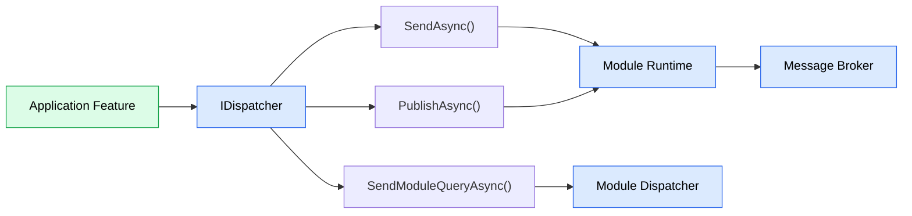

# ADR-003 - Module Communication Strategy

## Status

Accepted

> **Superseded in part by ADR-010 – Introduce a Custom Module Runtime.**
>
> This ADR remains the source of truth for JobWize's communication strategy.
> ADR-010 replaces the MediatR-based request execution mechanism described here with the custom module runtime while preserving the communication model and dispatcher abstractions defined in this document.

---

# Context

JobWize is composed of independent business modules.

Although modules collaborate to fulfill business requirements, they must remain loosely coupled and communicate through well-defined contracts rather than direct implementation dependencies.

Different communication scenarios have different requirements.

Some interactions execute business logic, others retrieve data, while others simply notify other modules that something has happened.

Using a single communication mechanism for every scenario would blur architectural boundaries and make the intent of the code less explicit.

---

# Decision

JobWize adopts three distinct communication mechanisms, each serving a specific architectural purpose.



Each dispatcher method represents a different communication pattern.

| Method                   | Purpose                                              |
| ------------------------ | ---------------------------------------------------- |
| `SendAsync()`            | Execute application logic inside the current module. |
| `SendModuleQueryAsync()` | Retrieve authoritative data from another module.     |
| `PublishAsync()`         | Notify other modules that something has happened.    |

Each mechanism exists because it represents a different architectural responsibility.

---

# Consequences

## Positive

-   Communication intent is explicit in the code.
-   Module boundaries remain well defined.
-   Synchronous and asynchronous communication are clearly separated.
-   Different communication patterns can evolve independently.
-   Future implementation changes do not affect application features.

## Trade-offs

Developers must understand when each communication mechanism is appropriate.

Although introducing multiple communication patterns increases the number of abstractions, each abstraction has a single, well-defined responsibility.

---

# Alternatives Considered

## Single Dispatcher Method

A generic dispatcher API such as:

```csharp
await dispatcher.DispatchAsync(...);
```

could execute every type of operation.

### Advantages

-   Smaller public API.
-   One generic entry point.

### Reasons Not Chosen

Different communication patterns have different semantics.

Executing business logic, retrieving data from another module, and publishing an event are fundamentally different operations.

Using dedicated methods makes the architectural intent immediately visible in the code.

---

## Single Request Execution Engine

Another option would have been to route every communication pattern through the same execution mechanism.

### Advantages

-   One communication library.
-   Consistent programming model.

### Reasons Not Chosen

MediatR is intended for internal application communication.

Using it for cross-module interactions would blur module boundaries and make it difficult to distinguish internal requests from interactions between business modules.

Cross-module communication deserves its own abstraction.

---

## HTTP for Cross-Module Communication

Modules could communicate through HTTP, even while executing within the same application process.

### Advantages

-   Consistent with a future microservice architecture.
-   Well-understood communication model.

### Reasons Not Chosen

This introduces unnecessary serialization, networking, and infrastructure overhead for modules executing within the same process.

The architecture preserves the abstraction while allowing the implementation to evolve if modules are extracted into independent services.

---

## Integration Events for Every Interaction

Another alternative is to communicate exclusively through asynchronous events.

### Advantages

-   Loose coupling.
-   Fully event-driven architecture.

### Reasons Not Chosen

Integration events communicate that something has already happened.

They are not intended for request-response interactions or retrieving authoritative data.

Using events for synchronous communication would unnecessarily complicate workflows and reduce clarity.

---

# Rationale

Different communication scenarios require different architectural solutions.

By exposing dedicated methods through a single dispatcher abstraction, JobWize makes communication intent explicit while keeping application features independent of the underlying implementation.

This approach favors clarity over uniformity.

Rather than forcing every interaction through a single communication mechanism, each mechanism is designed for one specific responsibility and can evolve independently as the architecture grows.
