# ADR-004 - Reliable Integration Event Delivery with Outbox and Inbox

## Status

Accepted

---

# Context

Business modules communicate asynchronously through Integration Events.

The architecture must ensure that events are delivered reliably without creating inconsistencies between the application's database and the message broker.

The system must tolerate situations such as:

-   The database transaction succeeds but the message broker is temporarily unavailable.
-   A consumer receives the same message more than once.
-   A consumer fails while processing an event.
-   Temporary infrastructure failures during message publication or consumption.

Since the database and the message broker cannot participate in the same transaction, reliable event delivery requires a dedicated architectural approach.

---

# Decision

JobWize adopts the **Outbox** and **Inbox** patterns for all Integration Events.

Each business module owns:

-   An **Outbox** for reliable event publication.
-   An **Inbox** for reliable and idempotent event consumption.
-   An **Outbox Processor** responsible for publishing pending events.
-   An **Inbox Processor** responsible for processing received events.

Application features never publish events directly to the message broker.

Instead, the dispatcher records the event in the module's Outbox as part of the current business transaction.

Background services then publish pending events to the message broker and process incoming events from each module's Inbox.

```mermaid
flowchart LR

    subgraph Identity["Identity Module"]

        Feature["Application Feature"]

        Dispatcher["PublishAsync()"]

        Outbox["Outbox"]

        OutboxProcessor["Outbox Processor"]

        Feature --> Dispatcher

        Dispatcher --> Outbox

        Outbox --> OutboxProcessor

    end

    Broker["Message Broker"]

    subgraph Companies["Companies Module"]

        Inbox["Inbox"]

        InboxProcessor["Inbox Processor"]

        Handler["Integration Event Handler"]

        Inbox --> InboxProcessor

        InboxProcessor --> Handler

    end

    OutboxProcessor --> Broker

    Broker --> Inbox

    classDef application fill:#dcfce7,stroke:#16a34a,color:#000;
    classDef infrastructure fill:#dbeafe,stroke:#2563eb,color:#000;

    class Feature,Handler application;
    class Dispatcher,Outbox,Inbox,OutboxProcessor,InboxProcessor,Broker infrastructure;
```

| Pattern    | Responsibility                                                             |
| ---------- | -------------------------------------------------------------------------- |
| **Outbox** | Guarantees reliable publication of Integration Events.                     |
| **Inbox**  | Guarantees reliable, idempotent processing of received Integration Events. |

---

# Consequences

## Positive

-   Integration Events are never lost because of temporary broker failures.
-   Event consumption remains idempotent.
-   Transient failures can be retried automatically.
-   Failed messages can be isolated after retry exhaustion instead of being silently lost.
-   Poison messages do not repeatedly disrupt event processing, allowing the module to continue operating while the failed message awaits investigation.
-   Every module owns its complete event processing pipeline.

## Trade-offs

-   Additional database tables are required.
-   Background processing becomes part of every module.
-   Event delivery becomes eventually consistent.
-   The overall messaging infrastructure is more complex than direct publication.

These trade-offs are accepted in exchange for reliable asynchronous communication.

---

# Alternatives Considered

## Publish Directly to the Message Broker

Application features could publish Integration Events immediately after executing business logic.

### Advantages

-   Simpler implementation.
-   No background processing.

### Reasons Not Chosen

If the database transaction commits successfully but the message broker is unavailable, the business operation succeeds while the corresponding Integration Event is permanently lost.

This creates inconsistent state between modules.

---

## Distributed Transactions (Two-Phase Commit)

The database and the message broker could participate in a distributed transaction.

### Advantages

-   Strong consistency across resources.
-   Single transactional boundary.

### Reasons Not Chosen

Distributed transactions significantly increase operational complexity, reduce scalability, and are not universally supported across messaging technologies.

The architecture instead favors eventual consistency with reliable delivery.

---

## Best-Effort Retry

Application features could attempt to publish directly to the broker and retry publication if it fails.

### Advantages

-   Relatively simple implementation.
-   No Outbox table.

### Reasons Not Chosen

Retries cannot guarantee reliable delivery.

If the application terminates after the database transaction commits but before publication succeeds, the Integration Event is permanently lost.

Reliable publication requires the event to be durably persisted before publication is attempted.

---

# Rationale

Reliable asynchronous communication should not depend on the availability of external infrastructure during a business transaction.

By persisting Integration Events before publication and independently tracking message processing, JobWize guarantees reliable event delivery while preserving loose coupling between business modules.

This approach accepts eventual consistency in exchange for significantly improved reliability, resiliency, and fault tolerance.
