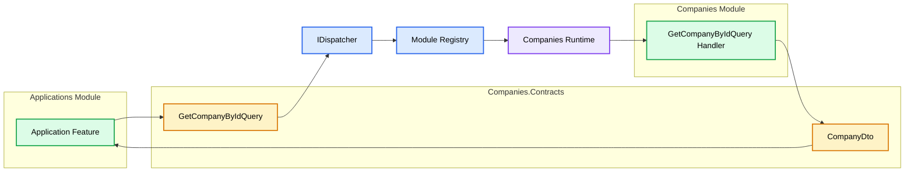
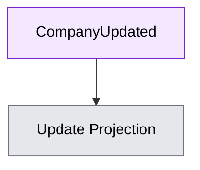
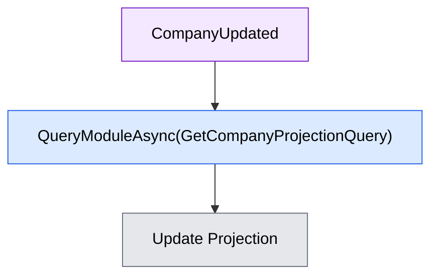

# ADR-007 - Module Query Dispatcher

## Status

Accepted

---

# Context

Business modules occasionally require authoritative data owned by another module.

Examples include:

-   The Applications module needs Company information.
-   The Companies module needs User information.
-   The Notifications module needs User preferences.

Although modules collaborate, they must not share persistence.

Direct access to another module's DbContext, repositories, or entities would violate module ownership and introduce tight coupling.

The architecture therefore requires a mechanism for retrieving data across module boundaries while preserving module independence.

---

# Decision

JobWize exposes a dedicated module query API through the `IDispatcher` for synchronous cross-module read operations.

The Dispatcher delegates the request to the owning module's runtime, which resolves and executes the corresponding Module Query Handler.
Application features request external data by sending a **Module Query** through the dispatcher.

Both the **Module Query** and its **response DTO** belong to the owning module's **Contracts** project.

Consumer modules depend only on another module's contracts—not on its implementation.

The dispatcher exposes a dedicated API for cross-module queries.

It does **not** expose:

-   DbContexts.
-   Repositories.
-   Domain Entities.
-   Database tables.

Only contract types defined by the owning module may cross module boundaries.

The Module Query Dispatcher is an architectural abstraction implemented by JobWize.

Its purpose is to define how modules communicate rather than how communication is physically implemented.

The underlying implementation may evolve over time without affecting application features.

For example:

-   Today: In-process dispatch.
-   Tomorrow: HTTP.
-   Tomorrow: gRPC.
-   Tomorrow: Another synchronous transport.

Application code remains independent of the transport technology.

---

# Projection Synchronization

When a module maintains projections of data owned by another module, Integration Events are treated as **notifications**, not as authoritative snapshots.

Instead of updating projections directly from event payloads:

JobWize synchronizes projections by querying the owning module.

This ensures that projections are populated using the authoritative state owned by the source module rather than relying on potentially incomplete event payloads.
