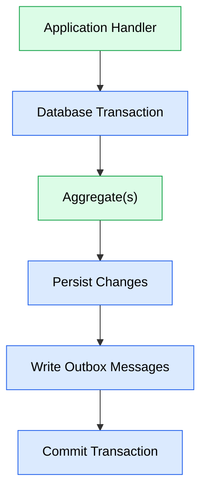
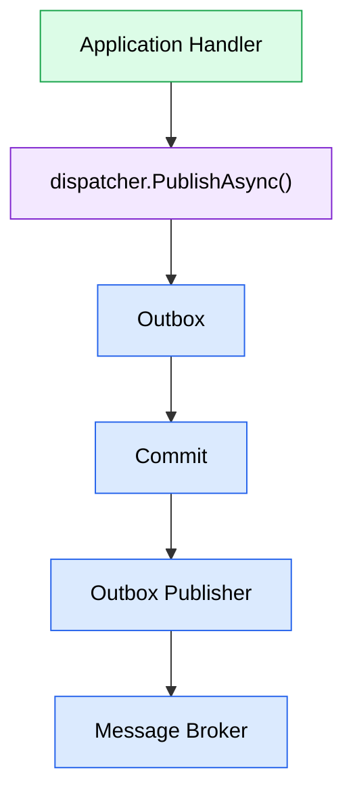

# ADR-008 - Transaction Boundaries

## Status

Accepted

> **Implementation updated by ADR-010 – Introduce a Custom Module Runtime.**
>
> This ADR remains the source of truth for JobWize's transaction boundaries.
> ADR-010 replaces the MediatR execution pipeline referenced here with the custom module runtime while preserving the transactional guarantees described in this document.

---

# Context

A business operation typically consists of several steps:

-   Loading one or more aggregates.
-   Executing business logic.
-   Persisting changes.
-   Producing Integration Events.

These operations must either complete successfully as a single unit or leave the system unchanged.

At the same time, JobWize is composed of independent business modules that communicate through Module Queries and Integration Events.

The architecture therefore requires clearly defined transaction boundaries that preserve consistency within a module while avoiding distributed transactions across modules.

---

# Decision

The **Application Handler** defines the transactional boundary.

Each application request executes inside a single database transaction coordinated by the application execution pipeline provided by the module runtime.

Within that transaction, a handler may:

-   Load one or more aggregates.
-   Execute business logic.
-   Persist changes.
-   Produce one or more Integration Events.

All these operations succeed or fail together.



A handler may modify multiple aggregates belonging to the same module.

Regardless of the number of aggregates involved, they participate in the same transaction because they represent a single business operation.

---

# Integration Events

Integration Events are produced during the transaction but are **not** published directly to the message broker.

Instead, calling:

```csharp
dispatcher.PublishAsync(...)
```

stores the Integration Event in the module's Outbox as part of the current transaction.

Only after the transaction has successfully committed does the Outbox background service publish the event to the message broker.



This guarantees that other modules observe only committed state.

If the transaction is rolled back, no Outbox message exists and no Integration Event is published.

---

# Module Queries

Module Queries are synchronous, read-only operations.

They are **not** part of the caller's transaction.

When a handler executes a Module Query:

-   The target module reads only its committed data.
-   No transaction is shared between modules.
-   The query does not extend or participate in the caller's transaction.

Module Queries therefore provide synchronous access to authoritative data without introducing distributed transactions.

---

# Cross-Module Transactions

Transactions never span multiple modules.

Each module owns:

-   Its database schema.
-   Its DbContext.
-   Its transaction.

Business operations that require coordination between modules are completed through Integration Events rather than shared transactions.

This embraces eventual consistency while preserving module independence.

---

# Consequences

## Positive

-   Every business operation has a clear transactional boundary.
-   Multiple aggregates within the same module remain consistent.
-   Integration Events are published only after successful commits.
-   Cross-module communication remains independent of database transactions.
-   Distributed transactions are avoided.
-   Module ownership remains explicit.

## Trade-offs

-   Cross-module consistency is eventually consistent rather than immediate.
-   Business workflows spanning multiple modules require Integration Events.
-   Module Queries cannot observe uncommitted data.

These trade-offs are accepted in exchange for improved scalability, simpler deployment, and stronger module isolation.

---

# Alternatives Considered

## Distributed Transactions

Transactions could span multiple modules and databases.

### Advantages

-   Immediate consistency across modules.

### Reasons Not Chosen

Distributed transactions significantly increase operational complexity, reduce scalability, and tightly couple independent modules.

They conflict with the architectural goal of independently evolvable business modules.

---

## Multiple Transactions per Handler

A handler could commit changes incrementally throughout the execution of a business operation.

### Advantages

-   Simpler implementation for isolated persistence operations.

### Reasons Not Chosen

Partial commits can leave the system in an inconsistent state if later operations fail.

A handler represents a single business operation and should therefore execute atomically.

---

## Publishing Integration Events Before Commit

Integration Events could be sent directly to the message broker before the database transaction completes.

### Advantages

-   Immediate message publication.

### Reasons Not Chosen

Consumers could react to data that is later rolled back.

Writing Integration Events to the Outbox inside the transaction guarantees that only committed business operations are published.

---

# Rationale

JobWize defines the execution of an **Application Handler** as the unit of work.

Within a module, business operations execute atomically inside a single transaction.

Across modules, collaboration occurs through Module Queries and Integration Events rather than shared transactions.

A business operation is therefore either completed entirely within its owning module or coordinated asynchronously with other modules through Integration Events.

This execution model preserves strong transactional guarantees where they matter while allowing modules to remain independently deployable and scalable over time.
