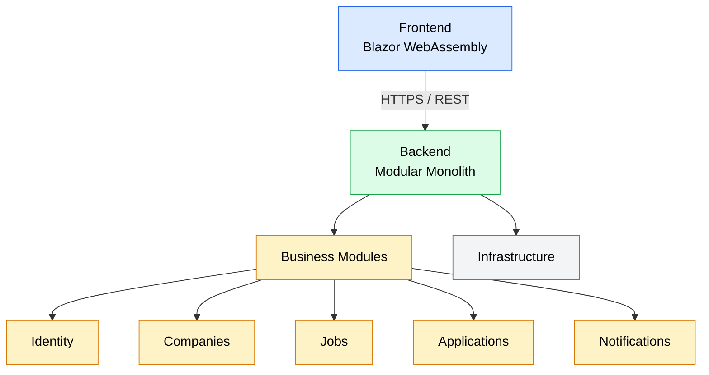

# JobWize Architecture Overview

## Introduction

JobWize is an open-source career management platform that helps job seekers organize, track, and optimize their job search while providing recruiters and companies with tools to manage recruitment workflows.

The system is composed of two primary applications:

-   **Frontend** – Provides the user interface for candidates and recruiters.
-   **Backend** – Implements the business logic, persistence, and integrations.

The frontend communicates exclusively with the backend through a REST API.

---

# High-Level Architecture

---

# Frontend

The frontend is responsible for:

-   User experience
-   Authentication
-   Dashboard and management interfaces
-   Consuming the backend REST API

The frontend contains no business logic beyond presentation and client-side validation.

---

# Backend

The backend is implemented as a **Modular Monolith**, where business capabilities are divided into independent modules that execute within a single application.

Each module encapsulates its own:

-   Business logic
-   Domain model
-   Persistence layer
-   Public contracts

This architecture provides strong separation between business domains while maintaining the simplicity of a single deployment.

Further details are documented in the following architecture documents.

---

# Design Goals

The architecture has been designed around the following goals:

-   Modularity
-   Maintainability
-   Scalability
-   Reliability
-   Testability
-   Simplicity
-   Extensibility

Every architectural decision documented throughout this guide should support one or more of these goals.

---

# Documentation

This document provides a high-level overview of the system.

The following documents describe the backend architecture in greater detail.

| Document                      | Description                                                 |
| ----------------------------- | ----------------------------------------------------------- |
| **01 - Backend Overview**     | Backend architecture principles and design philosophy.      |
| **02 - Solution Structure**   | Solution and project organization.                          |
| **03 - Module Architecture**  | Internal organization of each business module.              |
| **04 - Contracts**            | Public APIs, module contracts, and integration events.      |
| **05 - API Layer**            | HTTP API design and request lifecycle.                      |
| **06 - Module Communication** | Synchronous and asynchronous communication between modules. |
| **07 - Event Processing**     | Outbox, Inbox, retries, and event lifecycle.                |
| **08 - Database**             | Persistence strategy and database ownership.                |
| **09 - Deployment**           | Deployment architecture and infrastructure.                 |
