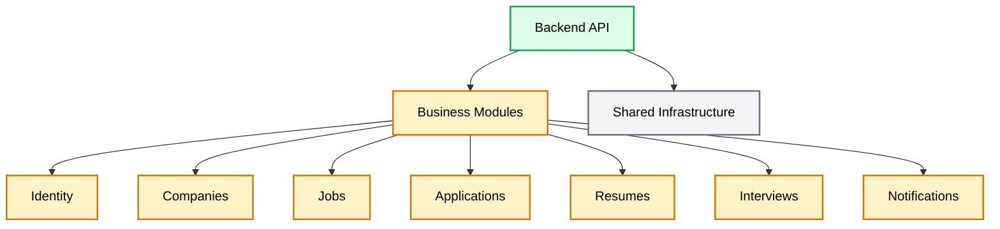

# Backend Architecture Overview

## Introduction

JobWize is designed as a **Modular Monolith**, where the application is composed of independent business modules running within a single process.

Each module encapsulates its own business logic, domain model, persistence layer, and public contracts, allowing the system to remain maintainable and scalable while avoiding the operational complexity of a distributed microservice architecture.

Although deployed as a single application, the architecture intentionally enforces strong module boundaries to facilitate future extraction into independent services if required.

---

# Why a Modular Monolith?

JobWize is expected to evolve over time while being developed and maintained by a relatively small team.

A Modular Monolith provides an excellent balance between simplicity and scalability by offering:

-   Clear separation of business domains.
-   High maintainability through module isolation.
-   Simpler deployment and debugging.
-   Shared infrastructure without distributed system complexity.
-   A clear migration path toward microservices if future requirements justify it.

The architecture prioritizes developer productivity while preserving long-term flexibility.

---

# High-Level Architecture

---

# Architectural Principles

The backend follows the following architectural principles.

## Module Ownership

Each business module owns:

-   Its business logic.
-   Its domain model.
-   Its persistence layer.
-   Its database schema.
-   Its public contracts.

No module may directly access another module's internal implementation.

---

## Contract-First Communication

Modules communicate exclusively through published contracts.

A module may depend on another module's **Contracts** project, but never on its implementation.

This ensures that module boundaries remain explicit and prevents accidental coupling between business domains.

---

## CQRS

The application follows the CQRS (Command Query Responsibility Segregation) pattern.

Commands modify state.

Queries retrieve information.

Each feature is implemented independently using a vertical slice approach.

---

## Feature-Oriented Organization

Business features are organized by use case rather than technical layer.

Instead of grouping code by Controllers, Services, or Validators, each feature contains everything required to implement a specific business operation.

This improves discoverability and keeps related code together.

---

## Module Communication

Communication between modules is intentionally explicit.

### Synchronous Communication

Modules obtain information from other modules using synchronous queries through a module dispatcher.

This is the preferred mechanism for retrieving business data.

### Asynchronous Communication

Business events are published as Integration Events.

These events notify other modules that a business action has occurred and are intended for notifications, projections, auditing, analytics, and other asynchronous workflows.

---

## Database

The application uses a single PostgreSQL database.

Each module owns its own schema and Entity Framework DbContext.

Although modules share the same physical database, they never access each other's tables directly.

---

## Reliability

Integration Events are processed using reliable messaging patterns.

The architecture incorporates:

-   Outbox Pattern for reliable publishing.
-   Inbox Pattern for reliable consumption.
-   Idempotent event handlers.
-   Controlled retry policies.
-   Failure tracking for business exceptions.

These mechanisms ensure that transient failures can recover automatically while permanent failures remain observable and manageable.
yment architecture and infrastructure.
