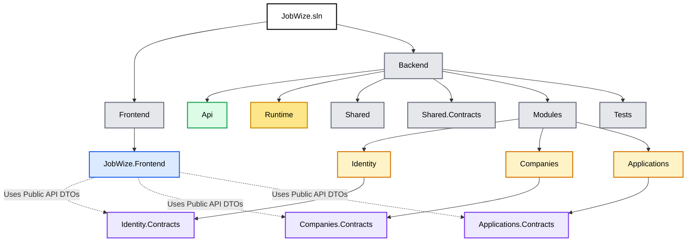

# Solution Structure

## Purpose

This document describes the physical organization of the JobWize solution.

It defines how projects are organized, the responsibilities of each project, and the dependency rules that must be respected throughout the codebase.

A consistent solution structure improves discoverability, maintainability, and helps preserve the architectural boundaries defined throughout this documentation.

---

# Solution Overview

The JobWize solution is composed of four primary areas:

-   Frontend
-   Backend API
-   Business Modules
-   Shared Libraries

The backend follows a Modular Monolith architecture, while the frontend is implemented as a Blazor WebAssembly application that communicates exclusively through the backend REST API.

---

# Solution Structure

```text
JobWize.sln
│
├── Frontend
│   └── JobWize.Frontend
│
└── Backend
    │
    ├── Api
    │   └── JobWize.Api
    │
    ├── Shared
    │   ├── JobWize.Shared
    │   └── JobWize.Shared.Contracts
    |
    ├── Runtime
    │   ├── JobWize.Runtime
    │   └── JobWize.Runtime.Contracts
    │
    ├── Modules
    │   ├── Identity
    │   │   ├── JobWize.Modules.Identity
    │   │   └── JobWize.Modules.Identity.Contracts
    │   │
    │   ├── Companies
    │   │   ├── JobWize.Modules.Companies
    │   │   └── JobWize.Modules.Companies.Contracts
    │   │
    │   ├── Applications
    │   │   ├── JobWize.Modules.Applications
    │   │   └── JobWize.Modules.Applications.Contracts
    │   │
    │   └── ...
    │
    └── Tests
        └── JobWize.UnitTests
```

---

# Project Responsibilities

## Frontend

Responsible for:

-   User interface
-   Routing
-   Authentication flow
-   API consumption
-   Client-side validation
-   State management

The frontend contains no business logic.

All business operations are performed through the backend API.

---

## API

Responsible for:

-   HTTP endpoints
-   Authentication & Authorization
-   Dependency Injection
-   Swagger / OpenAPI
-   Module registration
-   Middleware configuration

The API project should remain as thin as possible.

Business logic must never be implemented here.

---

## Business Modules

Each business capability is implemented as an independent module.

Every module owns:

-   Domain Model
-   Application Logic
-   Persistence
-   Database Schema
-   Public Contracts

Modules are isolated from one another and communicate only through published contracts.

---

## Contracts

Each module exposes a dedicated Contracts project.

Contracts define the public surface of a module and may contain:

-   API request DTOs
-   API response DTOs
-   Module Queries
-   Module Query responses
-   Notifications (including Integration Events)

Contracts must never contain:

-   Business logic
-   Entity Framework
-   Domain entities
-   Infrastructure code

---

## Shared

Shared projects contain reusable components that are common across multiple modules.

Examples include:

-   Base abstractions
-   Common interfaces
-   Shared utilities
-   Cross-cutting concerns

Shared projects should remain generic and must not contain business-specific logic.

---

## Tests

The solution contains unit, integration, and architecture tests. Their physical organization may evolve as the project grows.

---

# Dependency Rules

The following dependency rules must always be respected.



❌ Modules must never reference another module's implementation.

✔ Modules may reference another module's Contracts project.

✔ API may reference all modules.

✔ Frontend communicates only through HTTP.

---

# Naming Conventions

Projects follow the naming convention:

```text
JobWize.<Area>

JobWize.Api
JobWize.Frontend
JobWize.Shared
```

Business modules follow:

```text
JobWize.Modules.<Module>

JobWize.Modules.Identity
JobWize.Modules.Companies
JobWize.Modules.Applications
```

Contracts follow:

```text
JobWize.Modules.<Module>.Contracts
```

---

# Design Principles

The solution organization is designed around the following principles:

-   Strong module boundaries
-   Clear ownership
-   Explicit dependencies
-   Feature discoverability
-   Separation of concerns
-   Future microservice compatibility

Every project should have a single, well-defined responsibility.

No project should become a "catch-all" for unrelated functionality.
