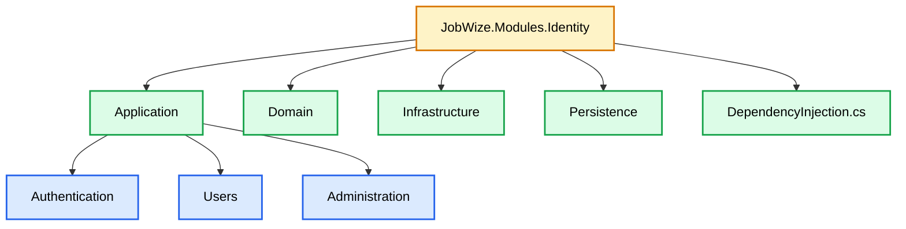
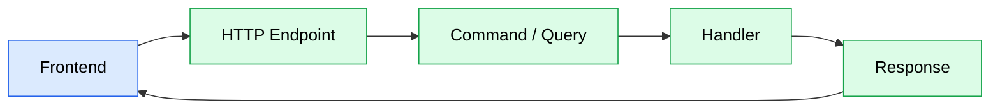

# Module Architecture

## Purpose

This document describes the internal architecture of a business module.

Every module in JobWize follows the same organization and conventions to ensure consistency, maintainability, and discoverability across the solution.

Although each module represents a different business capability, they all share the same architectural structure.

---

# Module Overview

A module is an autonomous business component responsible for a specific domain.

Each module owns:

-   Business rules
-   Application logic
-   Persistence
-   Infrastructure
-   Public contracts

Modules communicate only through their Contracts project.

They must never reference another module's implementation directly.

---

# Module Structure



---

# Folder Structure

```text
JobWize.Modules.Identity
│
├── Application
│   ├── Authentication
│   │   ├── Login.cs
│   │   ├── Logout.cs
│   │   ├── RefreshToken.cs
│   │   └── ResetPassword.cs
│   │
│   ├── Users
│   │   ├── CreateUser.cs
│   │   ├── UpdateUser.cs
│   │   ├── DeleteUser.cs
│   │   ├── GetUser.cs
│   │   └── GetUsers.cs
│   │
│   └── Administration
│       ├── CreateAdministrator.cs
│       ├── UpdateAdministrator.cs
│       └── DeleteAdministrator.cs
│
├── Domain
│
├── Infrastructure
│
├── Persistence
│
└── DependencyInjection.cs
```

---

# Responsibilities

## Application

Contains all application use cases.

Every use case is implemented as a single file following the Vertical Slice Architecture approach.

Application code is responsible for:

-   Commands
-   Queries
-   Validation
-   Request mapping
-   Endpoint registration
-   Business orchestration

Application code should not contain persistence details.

Request and Response contracts are defined in the module's Contracts project. The endpoint is responsible for mapping the request contract to the application command and returning the response contract.

---

## Domain

Contains the business model of the module.

The Domain Model encapsulates business state and behavior. All business rules, validations, and invariant enforcement are implemented inside the Domain Model rather than in application handlers.

Examples include:

-   Domain Models
-   Value Objects
-   Domain Events
-   Business Rules

Command handlers orchestrate use cases by loading Domain Models, invoking business behavior, and coordinating persistence, but they do not contain business logic.

The domain layer contains no HTTP concerns and remains independent from application flow.

---

## Infrastructure

Contains external integrations.

Examples include:

-   Email providers
-   File storage
-   Authentication providers
-   External APIs

Infrastructure should only implement abstractions required by the application.

---

## Persistence

Contains database-related code.

Examples include:

-   DbContext
-   Entity Configurations
-   Migrations
-   Repositories (if needed)

Each module owns its persistence.

---

# Feature Organization

Application features are grouped by business capability rather than technical concern.

Example:

```text
Application
│
├── Authentication
│   ├── Login.cs
│   ├── Logout.cs
│   └── RefreshToken.cs
│
├── Users
│   ├── CreateUser.cs
│   ├── UpdateUser.cs
│   ├── DeleteUser.cs
│   └── GetUser.cs
│
└── Administration
    ├── CreateAdministrator.cs
    └── DeleteAdministrator.cs
```

Grouping related features keeps large modules easy to navigate as they grow.

---

# Vertical Slice Convention

Each application use case is implemented in a single file.

Example:

```text
CreateUser.cs

├── Command
├── Validator
├── Handler
└── Endpoint
```

Keeping all components together improves discoverability and reduces unnecessary file navigation.

---

# Request Flow

Each request follows the same lifecycle.



---

# Dependency Rules

Within a module:

-   Application may access Domain.
-   Application may access Persistence.
-   Application may access Infrastructure through abstractions.
-   Infrastructure may depend on Domain.
-   Persistence may depend on Domain.

A module must never reference another module's implementation.

Cross-module communication is performed exclusively through Contracts.

---

# Authorization

JobWize currently uses predefined system roles.

```text
Candidate

Administrator
```

Roles are defined by the system and are not configurable.

Application features use role-based authorization to control access to protected operations.

---

# Design Principles

Every module should follow these principles:

-   Single responsibility
-   Feature-oriented organization
-   Strong encapsulation
-   Minimal coupling
-   Explicit dependencies
-   Vertical Slice Architecture
-   Consistent conventions

Following the same architecture across all modules makes the codebase easier to understand, easier to test, and easier to evolve over time.
