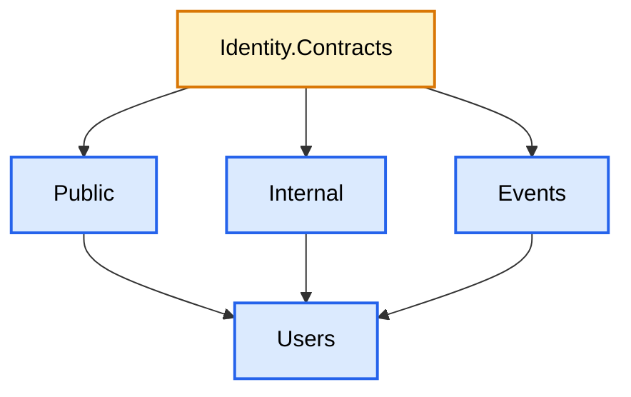
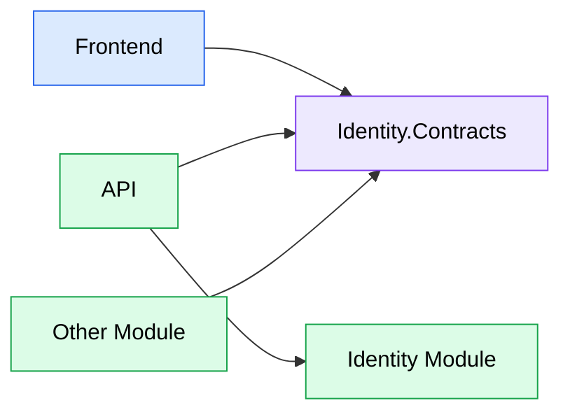

# Contracts

## Purpose

This document describes the purpose and organization of a module's Contracts project.

Contracts define the public interface of a module.

They provide a stable boundary between modules and ensure that implementation details remain encapsulated.

The frontend and other backend modules communicate exclusively through these contracts.

---

# Overview

Each business module exposes a dedicated Contracts project.

For example:

```text
JobWize.Modules.Identity
JobWize.Modules.Identity.Contracts
```

The implementation project contains the business logic.

The Contracts project contains only the objects that other projects are allowed to use.

---

# Responsibilities

A Contracts project may contain:

-   Public API DTOs
-   Internal Queries
-   Internal Query Responses
-   Integration Events

A Contracts project must **never** contain:

-   Business logic
-   Domain entities
-   Entity Framework
-   Infrastructure
-   Services
-   Validation
-   MediatR handlers

Contracts should remain lightweight and dependency-free.

---

# Project Structure



---

# Folder Structure

```text
JobWize.Modules.Identity.Contracts
│
├── Public
│   └── Users
│       ├── CreateUser.cs
│       ├── UpdateUser.cs
│       └── DeleteUser.cs
│
├── Internal
│   └── Users
│       ├── GetUserById.cs
│       └── GetUsers.cs
│
└── Events
    └── Users
        ├── UserCreated.cs
        ├── UserUpdated.cs
        └── UserDeleted.cs
```

---

# Public Contracts

Public contracts define the HTTP interface exposed to the frontend.

They contain only the request and response objects exchanged through the REST API.

Example:

```csharp
public static class CreateUser
{
    public sealed record Request(
        string Email,
        string FirstName,
        string LastName);

    public sealed record Response(
        Guid Id);
}
```

These contracts are shared between:

-   Frontend
-   API

This guarantees that both projects use the same request and response models.

---

# Internal Contracts

Internal contracts define synchronous communication between modules.

They are not intended to be used by the frontend.

Example:

```csharp
public static class GetUserById
{
    public sealed record Query(Guid UserId);

    public sealed record Response(
        Guid Id,
        string FirstName,
        string LastName,
        string Email);
}
```

These contracts are shared only between backend modules.

---

# Integration Events

Integration events notify other modules that something important has happened.

Unlike requests and queries, events are organized independently of application features.

Example:

```csharp
public sealed record UserCreated(
    Guid UserId,
    DateTime OccurredOn);
```

Events are grouped by business concept rather than by the feature that published them.

For example:

```text
Events
└── Users
    ├── UserCreated.cs
    ├── UserUpdated.cs
    └── UserDeleted.cs
```

This allows multiple features to publish the same event without duplicating its definition.

---

# Communication Overview



---

# Naming Convention

Each request, query, or event is defined in its own file.

Examples:

```text
Public
└── Users
    ├── CreateUser.cs
    ├── UpdateUser.cs
    └── DeleteUser.cs
```

```text
Internal
└── Users
    ├── GetUserById.cs
    └── GetUsers.cs
```

```text
Events
└── Users
    ├── UserCreated.cs
    ├── UserUpdated.cs
    └── UserDeleted.cs
```

This convention keeps related objects easy to locate and avoids large files containing unrelated contracts.

---

# Static Class Convention

Requests and queries are grouped inside a single static class.

Example:

```csharp
public static class CreateUser
{
    public sealed record Request(
        string Email,
        string FirstName,
        string LastName);

    public sealed record Response(
        Guid Id);
}
```

Likewise:

```csharp
public static class GetUserById
{
    public sealed record Query(Guid UserId);

    public sealed record Response(
        Guid Id,
        string FirstName,
        string LastName,
        string Email);
}
```

This approach groups all objects belonging to the same operation while keeping the project structure compact.

Integration events remain standalone types because they may be published by multiple application features.

---

# Ownership

Each contract has a single owner.

For example:

```text
Identity.Contracts

├── CreateUser.Request
├── CreateUser.Response
├── GetUserById.Query
├── GetUserById.Response
├── UserCreated
└── UserUpdated
```

No other module may redefine these contracts.

Modules consume the owner's contracts rather than creating their own copies.

---

# Design Principles

Contracts should always follow these principles:

-   Stable public interface
-   No business logic
-   No implementation details
-   Single ownership
-   Minimal dependencies
-   Clear organization
-   Strong module boundaries

The Contracts project represents the public language of a module and should evolve carefully to preserve compatibility across the solution.
