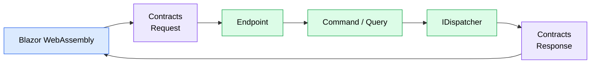

# API Layer

## Purpose

This document describes how HTTP requests are processed by the backend.

The API layer acts as the entry point of the application.

Its responsibility is to translate incoming HTTP requests into application commands or queries while remaining completely independent from business logic.

---

# Request Lifecycle

Every HTTP request follows the same lifecycle.



The `IDispatcher` abstracts the underlying communication mechanism.

Application features remain unaware of whether a request is processed locally, delegated to another module, or results in event publication.

---

# Responsibilities

The API layer is intentionally thin.

Its responsibilities are limited to:

-   Receiving HTTP requests.
-   Creating the corresponding Command or Query.
-   Dispatching the request through `IDispatcher`.
-   Returning the appropriate HTTP response.

Business logic must never be implemented inside the API layer.

---

# Endpoints

Each application feature owns its HTTP endpoint.

Endpoints are implemented using ASP.NET Core Minimal APIs.

For example:

```text
Application
└── Users
    └── CreateUser.cs
```

The endpoint is responsible only for translating the HTTP request into an application command or query.

Example:

```csharp
internal sealed class Endpoint : IEndpoint
{
    public void Map(RouteGroupBuilder group)
    {
        group.MapPost("/", Handle);
    }

    private static async Task<IResult> Handle(
        Request request,
        IDispatcher dispatcher,
        CancellationToken cancellationToken)
    {
        var command = new Command(
            request.Email,
            request.FirstName,
            request.LastName);

        return await dispatcher.SendAsync(
            command,
            cancellationToken);
    }
}
```

Endpoints should remain lightweight.

They must not contain business logic.

---

# Requests and Commands

Although Requests and Commands often contain similar data, they represent different concepts.

A Request belongs to the transport layer.

A Command or Query belongs to the Application layer.

Keeping them separate allows the public API to evolve independently from the application's internal implementation.

Commands may eventually require additional information obtained from the current execution context without affecting the public HTTP contract.

---

# Current User

Business logic frequently requires information about the authenticated user.

Rather than passing this information through every Command, handlers access it through an application service.

Example:

```csharp
public interface IUserContext
{
    Guid? UserId { get; }

    bool IsAuthenticated { get; }
}
```

The implementation retrieves information from the current HTTP context while exposing a simple abstraction to the Application layer.

This keeps Commands focused on business intent while avoiding unnecessary duplication of contextual information.

---

# Feature Structure

Each application feature follows the same organization.

```text
CreateUser.cs

CreateUser
├── Command
├── Handler
└── Endpoint
```

Additional components, such as validators or mappings, may be introduced when required by the feature.

Keeping all implementation details together improves discoverability and reduces unnecessary file navigation.

---

# Relationship with the Application Layer

The API layer is responsible only for accepting HTTP requests and dispatching them.

The execution of application use cases—including validation, command handling, business orchestration, and response generation—is described in **11 - Application Layer**.

---

# Design Principles

The API layer follows these principles:

-   Thin HTTP layer.
-   One endpoint per feature.
-   Endpoints never contain business logic.
-   Public contracts remain separate from application commands.
-   Communication occurs exclusively through `IDispatcher`.
-   HTTP concerns remain isolated from the Application and Domain layers.
-   Feature-oriented organization.
