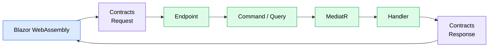
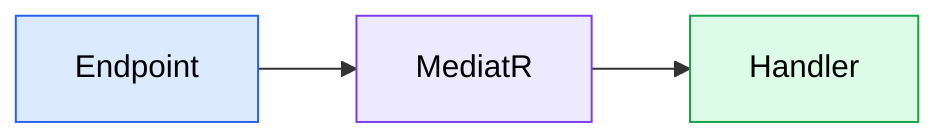

# API Layer

## Purpose

This document describes how HTTP requests are processed by the backend.

The API layer acts as the entry point of the application.

Its responsibility is to translate incoming HTTP requests into application commands or queries while remaining independent from business logic.

---

# Request Lifecycle

Every request follows the same lifecycle.



---

# Responsibilities

The API layer is intentionally thin.

Its responsibilities are limited to:

-   Receiving HTTP requests.
-   Creating the corresponding Command or Query.
-   Sending the request through MediatR.
-   Returning the response.

Business logic must never be implemented inside the API layer.

---

# Endpoints

Each application feature owns its HTTP endpoint.

Endpoints are implemented using ASP.NET Core Minimal APIs.

For example:

```text
Application
└── Users
    └── CreateUser.cs
```

The endpoint is responsible only for translating the HTTP request into an application command.

Example:

```csharp
internal sealed class Endpoint : IEndpoint
{
    public void Map(RouteGroupBuilder group)
    {
        group.MapPost("/", Handle);
    }

    private static async Task<CreateUser.Response> Handle(
        CreateUser.Request request,
        ISender sender,
        CancellationToken cancellationToken)
    {
        var command = new Command(
            request.Email,
            request.FirstName,
            request.LastName);

        return await sender.Send(command, cancellationToken);
    }
}
```

Endpoints should remain lightweight.

They must not contain business logic.

---

# Commands and Queries

The Application layer defines its own Commands and Queries.

These are independent from the public HTTP contracts.

For example:

```csharp
internal sealed record Command(
    string Email,
    string FirstName,
    string LastName)
    : IRequest<CreateUser.Response>;
```

Keeping Commands separate allows the application layer to evolve independently from the external API.

---

# Why Separate Requests and Commands?

Although they may initially contain the same properties, Requests and Commands represent different concepts.

A Request belongs to the transport layer.

A Command belongs to the application layer.

This separation allows Commands to evolve without affecting the public API.

For example, a Command may eventually require additional information obtained from the current execution context.

---

# MediatR

Endpoints never execute business logic directly.

Instead, they send Commands or Queries through MediatR.



This keeps the API layer independent from the implementation details of each feature.

---

# Validation

Validation is performed inside the Application layer using FluentValidation.

Each feature owns its own validator.

Example:

```csharp
internal sealed class Validator
    : AbstractValidator<Command>
{
    public Validator()
    {
        RuleFor(x => x.Email)
            .NotEmpty()
            .EmailAddress();

        RuleFor(x => x.FirstName)
            .NotEmpty();
    }
}
```

Validation remains close to the business use case rather than the transport layer.

---

# Handlers

Handlers execute the application use case.

Typical responsibilities include:

-   Executing business rules.
-   Accessing persistence.
-   Publishing integration events.
-   Returning the response.

Handlers should remain independent from HTTP.

---

# Current User

Business logic frequently requires information about the authenticated user.

Rather than passing this information through every Command, handlers access it through an application service.

Example:

```csharp
public interface IUserContext
{
    Guid? UserId { get; }

    bool IsAuthenticated { get; }
}
```

The implementation retrieves information from the current HTTP context while exposing a simple abstraction to the application layer.

This keeps Commands focused on business intent while avoiding unnecessary duplication of contextual information.

---

# Feature Structure

Each application feature follows the same organization.

```text
CreateUser.cs

CreateUser
├── Command
├── Validator
├── Handler
└── Endpoint
```

This convention keeps all implementation details of a feature together in a single file.

---

# Design Principles

The API layer follows these principles:

-   Thin HTTP layer.
-   One endpoint per feature.
-   Business logic belongs to handlers.
-   Validation belongs to the Application layer.
-   Endpoints communicate through MediatR.
-   Public contracts remain separate from application commands.
-   Feature-oriented organization.
