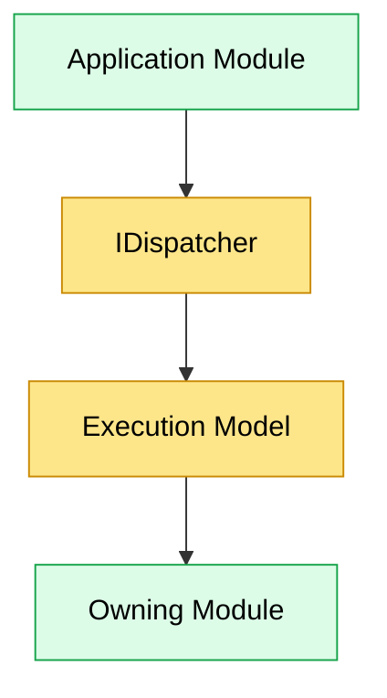
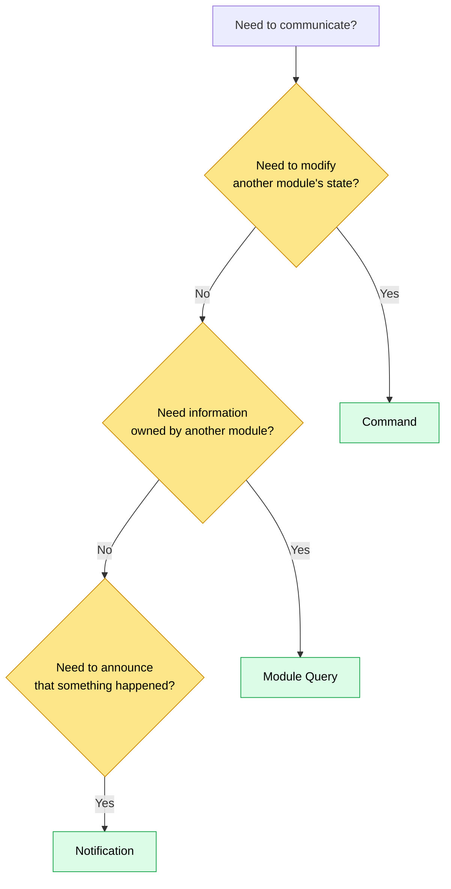
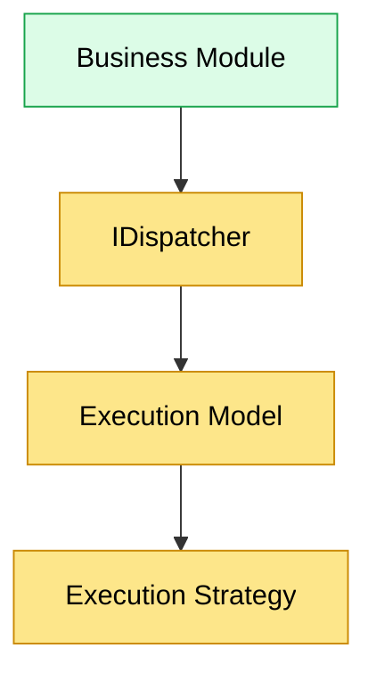

# Module Communication

## Overview

Business modules in JobWize collaborate without referencing one another directly.

Each module owns its business logic, persistence, and application features. Other modules interact with it exclusively through publicly exposed contracts and the shared `IDispatcher` abstraction.

The runtime coordinates all communication between modules, allowing application code to remain independent from the underlying execution strategy.

As a result, modules describe **what** they want to communicate, while the configured execution model determines **how** that communication is performed.

---

## Communication Principles

Module communication follows a small number of architectural principles.

-   Every module owns its own business logic and persistence.
-   Modules expose contracts, never implementations.
-   Modules never access another module's database.
-   Modules communicate exclusively through the shared `IDispatcher`.
-   Communication semantics are determined by the configured execution model.
-   Business code remains unaware of the underlying communication infrastructure.

These principles preserve module independence while allowing modules to collaborate as a single application.

---

## Communication Model

Application code never communicates directly with another module.

Instead, every interaction passes through the Dispatcher.



The Dispatcher provides a stable programming model for business modules.

The configured execution model determines how requests and notifications are ultimately processed.

This separation allows communication strategies to evolve without affecting application code.

---

## Communication Patterns

Modules communicate using three different interaction patterns.

Each pattern represents a different intent and should be chosen according to the business operation being performed.

| Pattern      | Purpose                                      | Expected Outcome             |
| ------------ | -------------------------------------------- | ---------------------------- |
| Command      | Modify application state                     | Changes data                 |
| Module Query | Retrieve information owned by another module | Returns data                 |
| Notification | Announce that something has happened         | Triggers additional behavior |

Although these patterns share the same communication infrastructure, they represent fundamentally different responsibilities.

---

## Commands

Commands represent business operations that modify application state.

A command always belongs to exactly one module and is handled by a single command handler.

Typical examples include:

-   Register Candidate
-   Create Company
-   Schedule Interview

Each command is owned and handled by a single module.

If another module needs to initiate a business operation, it does so by communicating through the owning module's public contracts rather than invoking internal application logic.

---

## Module Queries

Module Queries allow one module to retrieve information owned by another module.

They provide synchronous read access without exposing another module's persistence model.

For example:

```text
Applications Module

↓

GetUserById

↓

Identity Module
```

Only public contracts are shared between modules.

Each module remains responsible for its own persistence and determines which information may be exposed to other modules.

---

## Notifications

Notifications represent facts that have occurred during application execution.

Unlike commands and queries, notifications are not directed toward a single module.

Instead, they allow multiple modules to react independently to the same business event.

For example:

```text
Candidate Registered

↓

Identity Module
Applications Module
Notifications Module
```

Modules publish notifications without knowing which other modules may respond.

The configured execution model is responsible for coordinating notification execution while preserving module boundaries.

---

## Choosing the Right Communication Pattern

Each communication pattern serves a different purpose.

Selecting the appropriate pattern depends on the intent of the interaction rather than the implementation details.



### Use a Command when...

-   a business operation modifies application state
-   a single module owns the operation
-   a response is expected

Examples:

-   Register Candidate
-   Create Company
-   Update Profile

---

### Use a Module Query when...

-   information is owned by another module
-   no state should be modified
-   a synchronous response is required

Examples:

-   Get User
-   Get Company
-   Get Candidate Profile

---

### Use a Notification when...

-   a business operation has completed
-   multiple modules may need to react
-   the publisher should remain unaware of subscribers

Examples:

-   Candidate Registered
-   Company Created
-   Interview Scheduled

Notifications describe facts rather than requests.

They announce that something has happened without specifying what other modules should do in response.

---

## Execution Models

Business modules communicate exclusively through the Dispatcher.

The Dispatcher itself does not determine how requests or notifications are executed.

Instead, it delegates execution to the configured **Execution Model**.

This separation allows the communication model to remain stable while the execution strategy evolves independently.



Application code does not depend on a specific execution strategy.

Instead, it expresses an intention to:

-   send a command
-   execute a module query
-   publish a notification

The execution model determines how those operations are performed.

---

### Monolith Execution

The current implementation provides a monolithic execution model.

All communication occurs inside the same application process.

Commands and module queries are executed synchronously by the owning module.

Notifications are coordinated through the runtime using notification waves.

From the perspective of application code, this behavior is completely transparent.

---

### Future Execution Models

The communication architecture has been designed so that additional execution models can be introduced without affecting business modules.

For example, a future execution model could coordinate communication through external infrastructure while preserving the same programming model.

Because application code depends only on the Dispatcher, business features remain independent from the underlying execution strategy.

The execution model therefore becomes responsible for **how** communication occurs, while business modules remain responsible only for **what** they want to communicate.

---

## Design Principles

Module communication in JobWize is governed by a small number of architectural principles.

### Explicit Module Ownership

Every business capability belongs to exactly one module.

Commands and module queries are always handled by the module that owns the corresponding business functionality.

Modules never execute another module's internal application logic directly.

---

### Communication Through Contracts

Modules communicate exclusively through shared contracts.

Implementations remain private to the owning module, allowing modules to evolve independently while preserving a stable public interface.

---

### Infrastructure Transparency

Business modules communicate through the Dispatcher without knowing how requests or notifications are ultimately executed.

Routing, handler resolution, notification processing, and execution strategies remain runtime concerns.

This separation allows business logic to remain focused entirely on application behavior.

---

### Stable Programming Model

The communication model remains consistent regardless of the configured execution strategy.

Application code continues to send commands, execute module queries, and publish notifications through the same Dispatcher API.

Execution models determine how communication is performed without requiring changes to business modules.

---

## Summary

The JobWize communication architecture enables independently developed modules to collaborate while preserving strict architectural boundaries.

Modules communicate through a small set of well-defined interaction patterns:

-   Commands modify application state.
-   Module Queries retrieve information owned by another module.
-   Notifications announce completed business events.

All communication passes through the Dispatcher, allowing the configured Execution Model to coordinate execution independently of business logic.

This separation keeps modules loosely coupled, preserves ownership boundaries, and provides a communication model capable of evolving without affecting application code.
