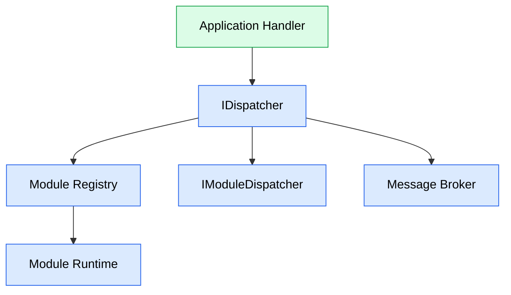
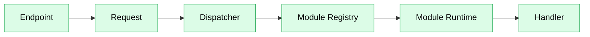
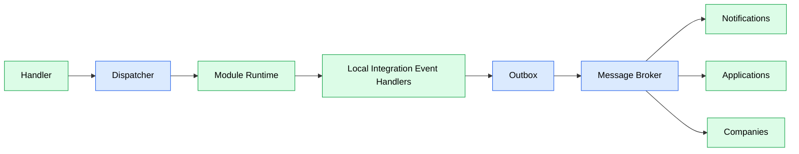
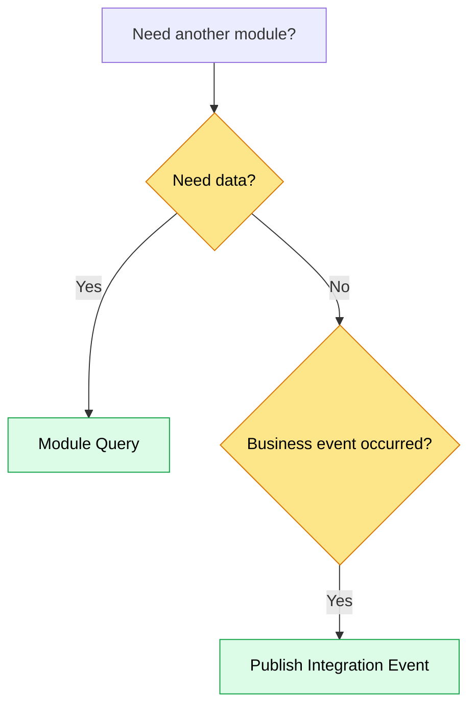

# Module Communication

## Purpose

This document describes how business modules communicate with each other while preserving module boundaries.

JobWize follows a modular monolith architecture where each module owns its business logic, persistence, and public contracts.

Modules never reference another module's implementation directly.

Instead, communication occurs through well-defined contracts and a runtime-aware dispatching infrastructure that preserves module ownership and architectural boundaries.

---

# Communication Principles

The communication architecture follows these principles.

-   Modules own their data.
-   Modules expose contracts, never implementations.
-   Commands never cross module boundaries.
-   Queries may retrieve data from another module.
-   Integration events notify modules that something has happened.
-   Communication infrastructure is hidden behind shared dispatcher abstractions that route requests according to module ownership.

---

# Communication Types

Modules communicate in three different ways.
| Type | Purpose | Execution pipeline |
| ------------------------ | ----------------------------------------------- | ----------------------------------------------------- |
| Local Commands / Queries | Execute business logic inside the owning module | Dispatcher → Module Registry → Module Runtime |
| Module Queries | Read information from another module | Dispatcher → Module Dispatcher |
| Integration Events | Notify other modules about business events | Dispatcher → Module Runtime → Outbox → Message Broker |



---

# Dispatcher

The Application layer never communicates directly with the module runtime, integration event handlers, the message broker, or another module. All application communication is performed exclusively through the shared `IDispatcher` abstraction.

```csharp
public interface IDispatcher
{
    Task<TResponse> SendAsync<TResponse>(
        ICommand<TResponse> command,
        CancellationToken cancellationToken = default);

    Task<TResponse> SendAsync<TResponse>(
        IQuery<TResponse> query,
        CancellationToken cancellationToken = default);

    Task<TResponse> SendModuleQueryAsync<TResponse>(
        IModuleQuery<TResponse> query,
        CancellationToken cancellationToken = default);

    Task PublishAsync(
        IIntegrationEvent integrationEvent,
        CancellationToken cancellationToken = default);
}
```

`IDispatcher` serves as the single entry point for every communication pattern supported by the application. Depending on the request type, it delegates execution to the appropriate runtime component:

-   Local Commands and Queries are routed to the owning Module Runtime through the Module Registry.
-   Module Queries are delegated to the Module Dispatcher.
-   Integration Events are published through the owning Module Runtime, which executes local integration event handlers before coordinating the Outbox publishing workflow.

This design keeps business logic completely independent from the underlying communication infrastructure while allowing the runtime implementation to evolve without affecting application features.

---

# Local Communication

Commands and Queries executed inside the current module are processed through the custom module runtime. The dispatcher resolves the owning module through the module registry before delegating execution to that module's runtime.



The Application layer remains unaware of the underlying runtime implementation. It communicates exclusively through `IDispatcher`.

## Result Convention

All Commands, Queries and Module Queries return either `Result` or `Result<T>`.

Expected business failures are represented by a failed `Result` and never by exceptions.

Exceptions are reserved for unexpected failures such as infrastructure problems or programming errors.

The Presentation layer is responsible for translating a `Result` into an HTTP response (Problem Details), keeping the Application layer independent of HTTP concerns.

---

# Module Queries

Modules frequently require information owned by another module.

For example:

```text
Applications Module

↓

GetUserById

↓

Identity Module
```

Rather than accessing another module's database, a synchronous Module Query is executed.

```mermaid
flowchart LR

    A["Applications"]

    Dispatcher["IDispatcher"]

    ModuleDispatcher["IModuleDispatcher"]

    Registry["Module Registry"]

    Runtime["Identity Module Runtime"]

    Handler["Module Query Handler"]

    A --> Dispatcher

    Dispatcher --> ModuleDispatcher

    ModuleDispatcher --> Registry

    Registry --> Runtime

    Runtime --> Handler

    classDef module fill:#dcfce7,stroke:#16a34a,color:#000;
    classDef infrastructure fill:#dbeafe,stroke:#2563eb,color:#000;

    class A,Runtime,Handler module;
    class Dispatcher,ModuleDispatcher,Registry infrastructure;
```



Only contracts are shared between modules.

Module implementations remain encapsulated.

---

# Public Queries vs Module Queries

A feature may be exposed through both the public HTTP API and module-to-module communication.

Although they may represent the same business capability, they are considered different application entry points.

For example:

```text
GetUserById.cs

GetUserById
├── Query
├── ModuleQuery
├── QueryHandler
├── ModuleQueryHandler
└── Endpoint
```

This allows both use cases to evolve independently.

Typical differences include:

-   Authorization rules.
-   Visibility of soft-deleted entities.
-   Returned data.
-   Business validations.

The small amount of duplicated code is intentional and keeps architectural boundaries explicit.

---

# Integration Events

Integration Events represent business events that have occurred within a module.

They serve two purposes:

-   Notify handlers inside the owning module runtime to complete local business orchestration.
-   Notify other modules that a business event has occurred.

Integration Events are never used to request information from another module.

Example:

```text
UserCreated

↓

Identity Module
├── Generate Refresh Token
├── Send Welcome Email
└── Audit Logging

↓

Notifications
Applications
Companies
```

Application features publish integration events through the dispatcher.

The feature remains completely unaware of how notifications are processed or delivered.



---

# Event Publishing

Application features publish an integration event only once.

```csharp
await dispatcher.PublishAsync(
    new UserCreated(...),
    cancellationToken);
```

The dispatcher is responsible for the complete publishing workflow:

1. Publishing the event inside the owning module runtime.
2. Waiting for all local notification handlers (including nested notifications) to complete.
3. Recording the event in the Outbox.
4. Allowing the Outbox Processor to publish the event to the message broker after the surrounding transaction has been committed.

This guarantees that local business orchestration always completes before other modules are notified.

Application features remain completely unaware of these implementation details.

> **Note**
>
> The dispatcher does **not** publish directly to the message broker. Its responsibility is to coordinate the publishing workflow. Reliable delivery to other modules is handled asynchronously by the Outbox Processor, ensuring events are only published after a successful transaction commit.

---

# Choosing the Communication Pattern



---

# Design Principles

The communication architecture follows these rules.

-   Modules never reference another module's implementation.
-   Modules never access another module's database.
-   Commands never cross module boundaries.
-   Queries retrieve information synchronously.
-   Integration events notify other modules asynchronously.
-   Application features communicate only through the shared dispatcher.
-   Communication infrastructure remains hidden from business logic.
-   Public and module queries may evolve independently when their responsibilities differ.
-   Commands, Queries and Module Queries always return `Result` or `Result<T>`.
