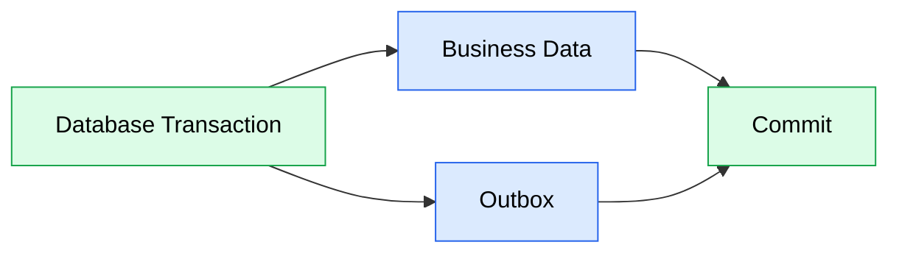
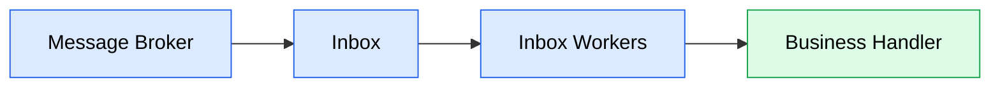
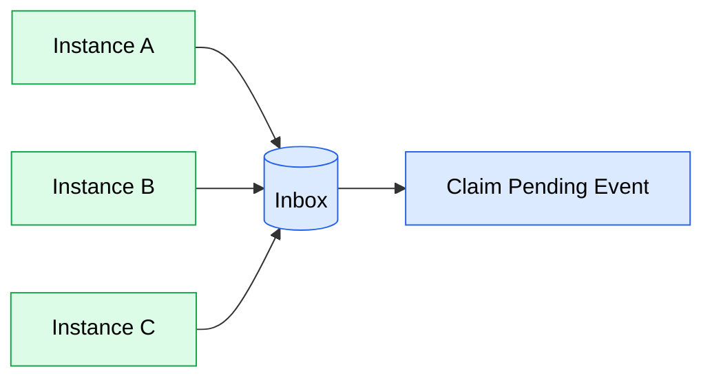
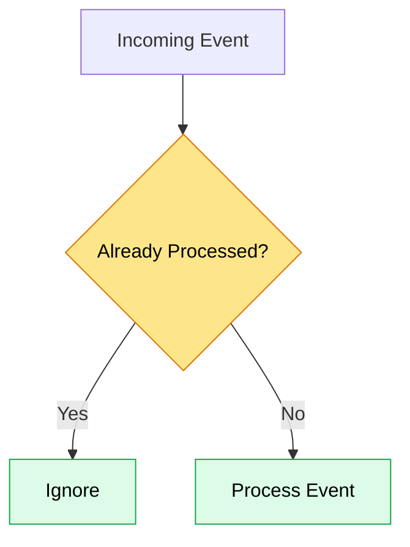

# Event Processing

## Purpose

This document describes how integration events are processed reliably across modules.

JobWize uses the Outbox and Inbox patterns to ensure that events are delivered reliably, processed safely, and never lost because of infrastructure failures.

The event processing pipeline is designed to provide:

-   Reliable event delivery.
-   Transactional consistency.
-   Idempotent event processing.
-   Controlled retries.
-   Failure recovery.

---

# Event Lifecycle

The following diagram illustrates the complete lifecycle of an integration event.

```mermaid
flowchart LR

    Handler["Application Handler"]

    Outbox["Outbox"]

    OutboxWorkers["Outbox Workers"]

    Broker["Message Broker"]

    Inbox["Inbox"]

    InboxWorkers["Inbox Workers"]

    Business["Business Handler"]

    Handler --> Outbox

    Outbox --> OutboxWorkers

    OutboxWorkers --> Broker

    Broker --> Inbox

    Inbox --> InboxWorkers

    InboxWorkers --> Business

    classDef application fill:#dcfce7,stroke:#16a34a,color:#000;
    classDef infrastructure fill:#dbeafe,stroke:#2563eb,color:#000;

    class Handler,Business application;
    class Outbox,OutboxWorkers,Broker,Inbox,InboxWorkers infrastructure;
```



An event passes through the following stages:

1. A business operation publishes an Integration Event.
2. The event is stored in the module's Outbox.
3. The surrounding transaction is committed.
4. The Outbox Workers publish the event to the message broker.
5. Another module receives the event.
6. The event is stored in the receiving module's Inbox.
7. The Inbox Workers execute the business handler.

---

# Outbox Pattern

Each module owns its own Outbox table.

The Outbox stores integration events before they are published to the message broker.



The business data and the integration event are committed within the same database transaction.

If the transaction rolls back, neither the business data nor the event is persisted.

This guarantees that events cannot be published without the corresponding business data.

---

# Outbox Workers

Publishing to the message broker is performed by background workers.

Their responsibilities are:

-   Read unpublished events from the Outbox.
-   Publish events to the message broker.
-   Mark successfully published events.

If the message broker is temporarily unavailable, the event remains in the Outbox and will be retried later.

No events are lost.

---

# Inbox Pattern

Each module also owns its own Inbox table.

Incoming events are stored before they are processed.



The Inbox provides:

-   Reliable processing.
-   Idempotency.
-   Retry tracking.
-   Failure tracking.

Each module owns its own Inbox.

Modules never access another module's Inbox.

The Inbox represents the source of truth for event processing within a module. Event status, retries, and failures are tracked independently of the message broker.

---

# Distributed Processing

The Outbox and Inbox Workers may run on multiple application instances simultaneously.

Each worker attempts to claim work from its module's Outbox or Inbox.

The database coordinates ownership of individual events, ensuring that each event is processed by only one instance at a time.

This allows event processing to scale horizontally without requiring changes to the application architecture.



---

# Inbox Status

Every Inbox entry has a processing status.

| Status     | Description                                      |
| ---------- | ------------------------------------------------ |
| Pending    | Waiting to be processed.                         |
| Processing | Currently being processed.                       |
| Processed  | Successfully completed.                          |
| Failed     | Processing failed and requires manual attention. |

These statuses allow failed events to be retried without relying on the message broker.

---

# Idempotency

Message brokers provide **at-least-once delivery**.

An event may therefore be delivered more than once.

To prevent duplicate processing, each Inbox stores the unique EventId.

Before processing an event, the Inbox Workers verify whether the event has already been completed.



This guarantees that processing remains safe even when duplicate deliveries occur.

---

# Retry Strategy

Not every failure should be treated equally.

JobWize distinguishes between different categories of failures.

| Failure Type   | Retry |
| -------------- | ----- |
| Infrastructure | Yes   |
| Transient      | Yes   |
| Business       | No    |

Examples of infrastructure failures include:

-   Message broker unavailable.
-   Database temporarily unavailable.
-   Network failures.

Examples of transient failures include:

-   Deadlocks.
-   Timeouts.
-   Optimistic concurrency conflicts.

Examples of business failures include:

-   Entity not found.
-   Invalid business state.
-   Business rule violations.

Infrastructure and transient failures may be retried automatically by the Inbox Workers according to the configured retry policy.

Business failures should be marked as **Failed** and require investigation.

---

# Failed Events

When an event cannot be processed successfully after the configured retry policy, its Inbox entry is marked as **Failed**.

The event remains stored within the owning module.

Failed events may later be:

-   Inspected.
-   Replayed.
-   Ignored.

This approach prevents poison messages from continuously blocking event processing.

---

# Event Ownership

Every module owns its own event processing infrastructure.

```text
Identity
├── Outbox
└── Inbox

Companies
├── Outbox
└── Inbox

Applications
├── Outbox
└── Inbox

Notifications
├── Outbox
└── Inbox
```

Modules never modify another module's Outbox or Inbox.

This preserves module boundaries and ownership.

---

# Design Principles

Event processing follows these principles.

-   Every module owns its own Outbox and Inbox.
-   Business data and Outbox entries are committed atomically.
-   Events are published only after a successful transaction commit.
-   Every received event is stored before processing.
-   The Inbox owns the event processing lifecycle.
-   Event processing is idempotent.
-   Infrastructure failures are retried automatically.
-   Business failures are recorded for later investigation.
-   Failed events never block the processing of new events.
-   Event processing supports horizontal scaling through distributed workers.
-   Modules remain responsible for their own event processing lifecycle.
