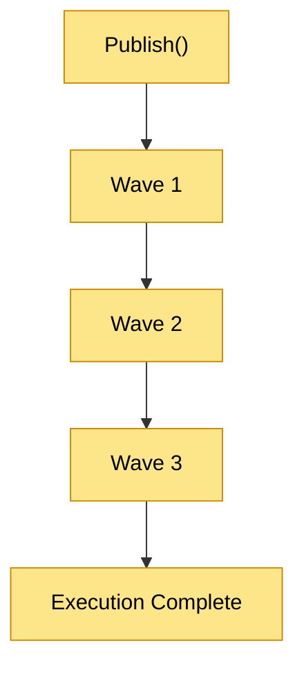
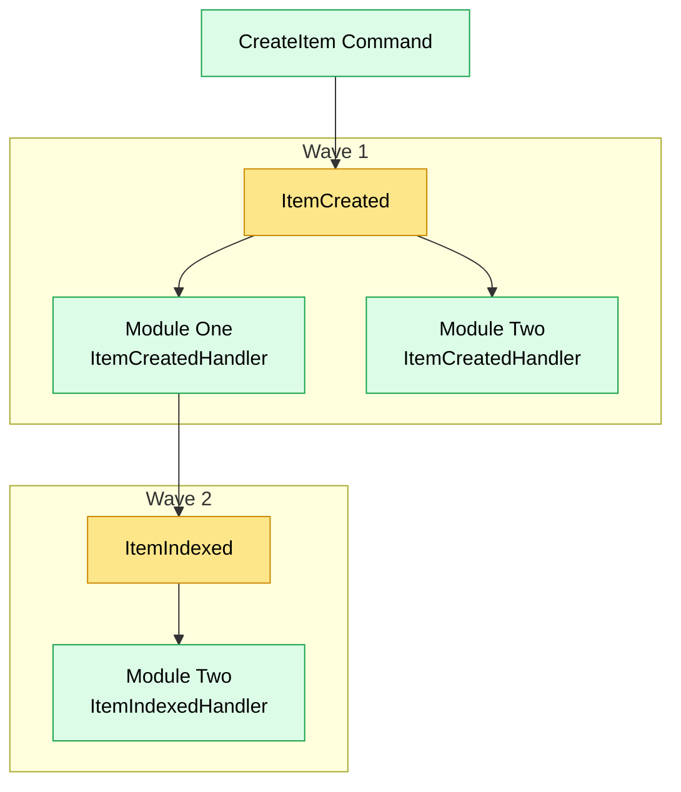

# Event Processing

## Overview

The JobWize event processing system enables application modules to react to domain events while remaining completely decoupled from one another.

Rather than allowing modules to invoke one another directly, business interactions occur through notifications published by the runtime.

The runtime is responsible for collecting, scheduling, and executing notifications using a deterministic execution model.

This approach allows multiple modules to participate in the same business workflow while preserving strict module boundaries and avoiding direct dependencies between modules.

Unlike traditional recursive event dispatching, JobWize processes notifications using **execution waves**, ensuring that newly published notifications never interrupt the execution currently in progress.

---

## Goals

The event processing system has four primary objectives:

-   Allow modules to react to business events without direct dependencies.
-   Execute notifications deterministically.
-   Prevent recursive notification execution.
-   Provide a foundation for future distributed event processing.

These goals allow application workflows to grow naturally while keeping the execution model predictable and easy to reason about.

---

## Notifications

The runtime processes notifications represented by `INotification`.

Notifications describe facts that have occurred during request execution and allow other parts of the application to react without introducing direct dependencies between modules.

Business modules typically publish notifications through the Dispatcher after successfully completing an application operation.

The runtime itself makes no distinction between different kinds of notifications.

Specialized abstractions such as `IIntegrationEvent` exist only to provide a stable programming model for business modules and do not change how notifications are processed.

The execution behavior of a notification is entirely determined by the configured execution model.

---

## Notification Processing

Notification processing begins when application code publishes a notification through the Dispatcher.

```csharp
await _dispatcher.Publish(new ItemCreated(itemId));
```

From this point onward, the runtime becomes responsible for coordinating notification execution.

Unlike request execution, where a single handler is selected, notifications may be handled by multiple modules simultaneously.

The execution model resolves every interested module and ensures that each notification handler is executed according to the runtime's execution strategy.

---

## Notification Context

Notification processing is coordinated through a **Notification Context**.

The Notification Context represents the state of an ongoing notification execution.

Rather than executing notifications immediately when they are published, the runtime first records them inside the current notification context.

This allows the runtime to coordinate complex notification chains while preserving deterministic execution.

At any point during execution, the notification context maintains two collections:

-   the notifications currently being executed
-   the notifications scheduled for the next execution wave

This separation prevents newly published notifications from interrupting handlers that are already executing.

---

## Notification Waves

Notifications are executed in **waves**.

Each wave represents a group of notifications that are executed together before moving on to the next group.



When notification execution begins, the published notification becomes the first execution wave.

Every handler interested in that notification is executed.

If one of those handlers publishes additional notifications, those notifications are **not executed immediately**.

Instead, they are collected and scheduled for the next execution wave.

Only after every handler in the current wave has completed does the runtime begin executing the next wave.

This process repeats until no additional notifications remain.

---

## Nested Notifications

Handlers are free to publish additional notifications while processing an existing one.

For example:

```text
CreateItem Command
        │
        ▼
 ItemCreated
      │
      ├──────────────► Module Two
      │
      ▼
Module One
      │
      ▼
 ItemIndexed
```

Although `ItemIndexed` is published while `ItemCreated` is still being processed, it does not interrupt the current execution.

Instead, the runtime schedules it for the following execution wave.

This guarantees that every handler interested in `ItemCreated` completes before any handler begins processing `ItemIndexed`.

By processing notifications in waves rather than recursively, the runtime produces deterministic and predictable execution regardless of the depth of the notification chain.

The following example illustrates how nested notifications are processed across execution waves.

Although `ItemIndexed` is published while `ItemCreated` handlers are still executing, it is deferred until the next execution wave rather than being executed immediately.



---

## Execution Guarantees

The event processing model provides several guarantees that simplify reasoning about application workflows.

These guarantees remain true regardless of the number of participating modules or the depth of the notification chain.

---

### Complete Wave Execution

Every notification handler belonging to the current execution wave completes before the runtime begins processing the next wave.

Notifications published during the execution of a handler never interrupt handlers that are already running.

This produces deterministic execution ordering and prevents recursive execution.

---

### Deterministic Processing

Notification execution always follows the same algorithm:

1. execute the current wave
2. collect newly published notifications
3. execute the next wave
4. repeat until no notifications remain

Because notifications are processed sequentially by execution waves, the overall execution flow remains predictable and easy to reason about.

---

### Module Independence

Modules never invoke notification handlers belonging to other modules directly.

Each module simply publishes notifications describing completed business operations.

The runtime determines which modules are interested in a notification and coordinates their execution.

This allows modules to collaborate without introducing compile-time dependencies between them.

---

### Transparent Publication

Application handlers remain unaware of the notification processing algorithm.

Handlers simply publish notifications through the Dispatcher.

The runtime is responsible for:

-   scheduling notifications
-   coordinating execution waves
-   invoking interested modules
-   completing notification execution

This keeps business logic focused entirely on application behavior.

---

### Single Execution Context

Every notification published as part of the same application operation participates in the same notification execution context.

As a result, nested notification chains are processed as one coordinated execution rather than as independent recursive publications.

This provides a consistent execution model regardless of how many notifications are produced during a workflow.

---

## Design Principles

The event processing system is built around a small set of architectural principles.

### Event-Driven Collaboration

Modules collaborate by publishing notifications rather than invoking one another directly.

The runtime becomes responsible for coordinating communication between interested modules.

---

### Deferred Execution

Notifications published during handler execution are deferred until the following execution wave.

This prevents recursive execution and guarantees deterministic processing.

---

### Infrastructure Independence

The notification model is independent of any messaging technology.

Notifications represent business facts.

The execution model determines how those notifications are processed, allowing different execution strategies without changing application code.

---

### Runtime Coordination

The runtime coordinates notification execution while remaining separate from business logic.

Application handlers publish notifications, while the runtime manages scheduling, routing, and execution.

---

## Summary

The JobWize event processing system enables independent modules to collaborate through notifications while preserving strict architectural boundaries.

By processing notifications using execution waves instead of recursive publication, the runtime provides deterministic execution, predictable notification ordering, and a scalable foundation for future execution models.

Business modules remain focused on publishing business events, while the runtime coordinates how those events are executed across the application.
