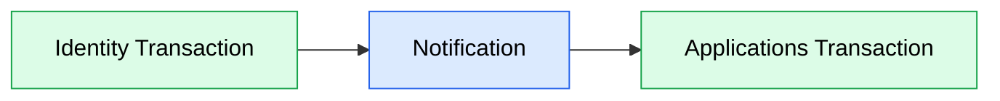
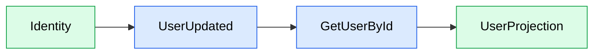
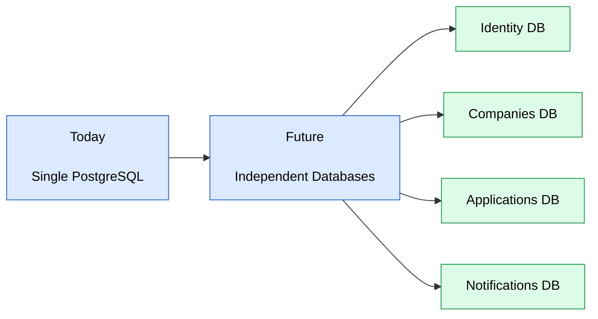

# Database

## Purpose

This document describes the database architecture adopted by JobWize.

The persistence layer is designed around module ownership rather than a shared relational model.

Each module owns its data, manages its own persistence, and remains independent from the internal implementation details of other modules.

The database architecture supports the current modular monolith while allowing individual modules to evolve into independent microservices in the future.

---

# Database Architecture

JobWize currently uses a single PostgreSQL database.

Each module owns its own schema.

```mermaid
flowchart TB

    PostgreSQL[(PostgreSQL)]

    PostgreSQL --> Identity["Identity Schema"]
    PostgreSQL --> Companies["Companies Schema"]
    PostgreSQL --> Applications["Applications Schema"]
    PostgreSQL --> Notifications["Notifications Schema"]

    Identity --> I1["Users"]
    Identity --> I2["RefreshTokens"]
    Identity --> I3["Inbox"]
    Identity --> I4["Outbox"]

    Companies --> C1["Companies"]
    Companies --> C2["CompanyLocations"]
    Companies --> C3["Inbox"]
    Companies --> C4["Outbox"]

    Applications --> A1["JobPostings"]
    Applications --> A2["JobApplications"]
    Applications --> A3["UserProjection"]
    Applications --> A4["Inbox"]
    Applications --> A5["Outbox"]

    Notifications --> N1["Notifications"]
    Notifications --> N2["Inbox"]
    Notifications --> N3["Outbox"]

    classDef database fill:#dbeafe,stroke:#2563eb,color:#000;
    classDef module fill:#dcfce7,stroke:#16a34a,color:#000;

    class PostgreSQL database;
    class Identity,Companies,Applications,Notifications,I1,I2,I3,I4,C1,C2,C3,C4,A1,A2,A3,A4,A5,N1,N2,N3 module;
```



Although every module shares the same PostgreSQL instance, each schema remains exclusively owned by its corresponding module.

Modules never access another module's tables directly.

---

# Module Ownership

Each module owns:

-   Schema
-   Tables
-   Migrations
-   DbContext

Depending on the configured execution model, modules may additionally own:

-   Inbox
-   Outbox

Example:

```text
Identity

├── IdentityDbContext
├── Migrations
├── Users
├── RefreshTokens
├── Inbox
└── Outbox
```

This ownership model ensures that persistence remains encapsulated inside the module.

---

# DbContext

Each module defines its own Entity Framework Core DbContext.

Example:

```text
IdentityDbContext

CompaniesDbContext

ApplicationsDbContext

NotificationsDbContext
```

Modules never expose their DbContext to other modules.

This prevents accidental coupling and simplifies future extraction into independent services.

---

# Migrations

Database migrations belong to the owning module.

Each module evolves its own schema independently.

This keeps schema changes isolated and allows modules to be deployed independently in the future.

---

# Cross-Module Access

Modules never query another module's database tables directly.

For example, the Applications module never executes queries against the Identity schema.

Instead, cross-module communication occurs through one of two mechanisms:

-   Module Queries.
-   Notifications.

This preserves module boundaries and prevents tight database coupling.

---

# Foreign Keys

Foreign keys are encouraged within a module.

For example:

```text
Company

↓

CompanyLocation
```

However, foreign keys must never cross module boundaries.

Instead of:

```text
Applications

UserId

FK → Identity.Users
```

Applications simply stores the UserId value.

Ownership of the User aggregate remains entirely within the Identity module.

---

# Transactions

Database transactions are scoped to a single module.

Each application request executes within a transaction that affects only the current module.

Cross-module consistency is coordinated through Runtime notifications. Distributed execution models may implement this using Integration Events.



This approach avoids distributed transactions while maintaining eventual consistency across modules.

---

# Projections

Some modules maintain local projections of data owned by another module.

For example, the Applications module may maintain a UserProjection.



When an Integration Event is received, the consuming module treats the event as a notification that data has changed. It then performs a Module Query to retrieve the current authoritative state before updating its local projection.

This approach provides several advantages:

-   Integration Events remain small and focused on business facts.
-   Projections always reflect the latest authoritative data.
-   Modules remain decoupled from another module's internal data representation.
-   Changes to an aggregate do not require expanding event payloads.

The projection is fully owned by the consuming module, even though its data originates from another module.

---

# Module Queries vs Projections

Modules can retrieve external data in two different ways.

## Module Queries

Module Queries request authoritative data directly from another module.

They are appropriate when:

-   The data is needed occasionally.
-   The latest state is required.
-   Maintaining a local copy is unnecessary.

```text
Applications

↓

GetUserById

↓

Identity
```

---

## Projections

Projections maintain a local read model inside the consuming module.

They are appropriate when:

-   External data is accessed frequently.
-   Fast local queries are required.
-   The module benefits from owning its own read model.

Projections are synchronized through notifications and refreshed using Module Queries.

---

# Audit Fields

Aggregate roots and entities with an independent lifecycle should maintain basic audit information.

The recommended convention is:

```text
CreatedAt

UpdatedAt
```

Technical tables such as Inbox and Outbox do not require these fields.

Likewise, value objects persisted in separate tables do not maintain an independent audit history, as they exist solely as part of their owning aggregate.

---

# Soft Delete

Soft deletion is a business decision rather than a persistence convention.

Entities that represent long-lived business concepts may support soft deletion.

Examples include:

-   Users.
-   Companies.
-   Job Postings.

Technical tables and value object tables should generally be physically deleted when no longer required.

---

# Optimistic Concurrency

Some aggregates may require optimistic concurrency to prevent concurrent updates from silently overwriting each other.

Concurrency control is handled by the persistence layer and remains transparent to the domain model.

The domain does not manage version numbers or concurrency tokens.

This allows business logic to remain focused solely on business behavior while the persistence infrastructure detects conflicting updates during database operations.

---

# Flexible Data Storage

While most module data is stored relationally, modules may persist certain data using PostgreSQL's JSON capabilities when appropriate.

Typical examples include:

-   Notification payloads.
-   Configuration documents.
-   Dynamic metadata.

JSON storage complements the relational model and should not replace it for structured business entities.

---

# Future Evolution

The current architecture uses a shared PostgreSQL database for operational simplicity.

As the system evolves, individual modules may be extracted into independent services with dedicated databases.



Because each module already owns its schema, DbContext, migrations, and persistence model, this transition can occur with minimal impact on the application architecture.

---

# Design Principles

The database architecture follows these principles.

-   Every module owns its schema.
-   Every module owns its DbContext and migrations.
-   Modules never access another module's tables directly.
-   Foreign keys are allowed only within a module.
-   Transactions are scoped to a single module.
-   Cross-module consistency is coordinated through Runtime notifications.
-   Projections are owned by the consuming module.
-   Notifications communicate business facts rather than complete aggregate state.
-   Projections are refreshed using Module Queries to retrieve authoritative data.
-   Soft deletion is applied only when required by the business domain.
-   Optimistic concurrency is handled by the persistence layer.
-   The architecture supports evolving from a modular monolith to independently deployed microservices.
