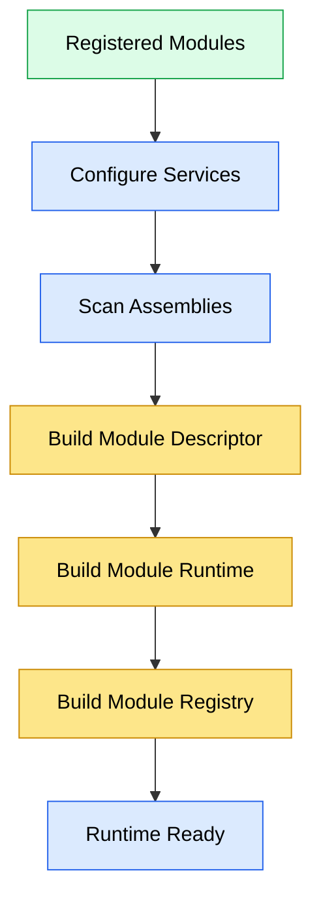
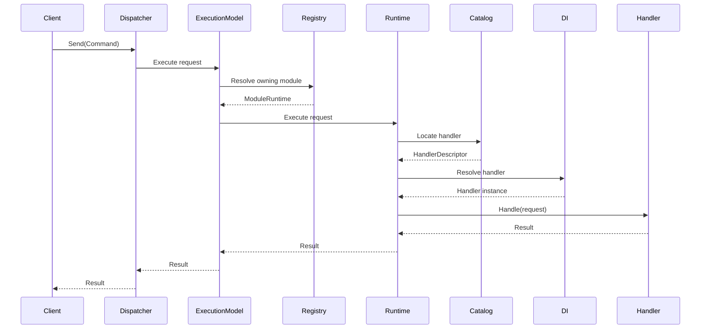

# Runtime

## Overview

The JobWize Runtime is the execution engine responsible for transforming independently developed business modules into a single executable application.

Rather than allowing modules to communicate directly, the runtime provides a unified execution model responsible for routing requests, locating handlers, and coordinating execution across module boundaries.

The runtime is intentionally independent of any transport technology. Whether a request originates from an HTTP endpoint, a background worker, a scheduled job, or another application component, it is executed through the same runtime pipeline.

The runtime is built around a small set of focused components, each responsible for a single aspect of request execution. During application startup these components compose an immutable execution model that remains unchanged for the lifetime of the application.

Once the application has started, request execution relies exclusively on cached runtime metadata and dependency injection, avoiding runtime discovery or reflection.

---

## Goals

The runtime has four primary objectives:

-   Provide a single entry point for executing application requests.
-   Preserve strict module boundaries while allowing controlled communication.
-   Execute requests efficiently using immutable runtime metadata.
-   Remain extensible without coupling business modules to infrastructure concerns.

These goals allow application features to remain completely unaware of how requests are discovered, routed, and executed.

---

## Runtime Architecture

The runtime separates request execution into distinct responsibilities.


Each component has a single responsibility.

The Dispatcher exposes the public API used by the application.

The Execution Model coordinates request execution.

The Module Registry determines which module owns a request.

Each Module Runtime executes requests belonging to a single module.

Finally, the Handler Catalog performs constant-time lookup of the appropriate application handler.

Together these components form the execution pipeline used throughout the application.

---

## Runtime Philosophy

The runtime follows a composition-first architecture.

During application startup, modules are scanned and immutable runtime metadata is generated. After startup, no additional discovery occurs.

This approach provides several advantages:

-   predictable request routing
-   constant-time handler lookup
-   minimal runtime overhead
-   complete module isolation
-   deterministic application startup

Because runtime metadata is immutable, execution behavior cannot change while the application is running. This makes request execution easier to reason about and simplifies testing.

---

## Runtime Composition

The runtime is composed once during application startup through the `AddRuntime()` composition root.

Rather than relying on automatic discovery during execution, every module is explicitly registered during application initialization.

```csharp
services.AddRuntime(
    configuration,
    options =>
    {
        options
            .AddModule(new IdentityModule());
            // .AddModule(new CompaniesModule());
            // .AddModule(new ApplicationsModule());
    });
```

Each registered module participates in the runtime composition process.

The runtime scans every module, builds its execution metadata, constructs a dedicated runtime instance, and finally creates the registry responsible for routing requests during execution.

Once this process completes, the runtime becomes immutable.

No additional modules, handlers, or routing information are added after application startup.

---

## Startup Sequence

Runtime composition follows a deterministic startup sequence.



Each step has a dedicated responsibility.

### Configure Services

Each module registers its own dependencies using the standard dependency injection container.

At this stage, modules remain completely independent and are unaware of one another.

### Scan Assemblies

The runtime scans each module assembly to discover application handlers.

This discovery process occurs only once during startup.

### Build Module Descriptor

The discovered handlers are transformed into an immutable `ModuleDescriptor`.

A descriptor represents the executable metadata of a module, including:

-   commands
-   queries
-   notifications
-   handler descriptors

The descriptor contains no service instances or runtime state.

It is purely structural metadata describing the capabilities of a module.

### Build Module Runtime

Using the generated descriptor, the runtime creates a dedicated `ModuleRuntime` for the module.

Each runtime owns the execution metadata required to execute requests belonging to that module.

Because every module receives its own runtime instance, execution remains isolated while sharing the same application infrastructure.

### Build Module Registry

Once every module runtime has been created, the runtime builds the `ModuleRegistry`.

The registry establishes the routing table used during request execution.

It determines:

-   which module owns a request
-   which modules subscribe to a notification

The registry itself contains no business logic.

Its only responsibility is routing.

---

## Immutable Runtime Metadata

One of the key design decisions of the runtime is that execution metadata is immutable.

After startup, every routing decision has already been computed.

This means that request execution never performs:

-   assembly scanning
-   reflection-based discovery
-   handler registration
-   routing computation

Instead, execution consists primarily of dictionary lookups followed by dependency injection.

This approach improves both performance and predictability while keeping runtime behavior deterministic throughout the application's lifetime.

---

## Runtime Components

The runtime is composed of a small number of focused components.

Each component has a single responsibility and collaborates with the others to execute application requests.

The following sections describe the responsibility of each component in the order in which they participate during execution.

---

### Dispatcher

The `Dispatcher` is the public entry point of the runtime.

It provides a simple API for sending requests and publishing notifications while remaining completely unaware of modules, handlers, or routing decisions.

Rather than executing requests directly, the Dispatcher delegates execution to the configured `IExecutionModel`.

This separation allows different execution strategies to be introduced without changing the public API exposed to the application.

Responsibilities:

-   Accept application requests.
-   Accept notifications.
-   Delegate execution.
-   Hide runtime implementation details from callers.

---

### Execution Model

The `ExecutionModel` coordinates request execution.

It acts as the orchestrator of the runtime by determining how requests and notifications should be executed.

The runtime currently provides a monolithic execution model where every module executes within the same process.

The execution model is responsible for:

-   locating the target module
-   invoking the appropriate module runtime
-   coordinating notification execution

Because execution behavior is centralized inside the execution model, additional execution strategies can be introduced in the future without modifying business modules.

Examples include:

-   distributed execution
-   remote module execution
-   asynchronous execution models

---

### Module Registry

The `ModuleRegistry` owns request routing.

Rather than executing requests itself, the registry simply determines which module runtime should receive a particular request.

During startup the registry builds immutable routing tables from every registered module.

These routing tables allow constant-time lookup during execution.

The registry is responsible for:

-   locating the owner of a request
-   locating modules interested in a notification

The registry never executes business logic.

Its sole responsibility is routing.

---

### Module Runtime

Each business module owns exactly one `ModuleRuntime`.

The module runtime represents the executable boundary of a module.

It receives requests already routed by the registry and is responsible for locating and invoking the appropriate handler inside its own module.

A module runtime never executes handlers belonging to another module.

This preserves strict module isolation while allowing the application to execute as a unified system.

Responsibilities:

-   execute commands
-   execute queries
-   execute notifications belonging to the module
-   resolve handlers using the handler catalog

---

### Handler Catalog

Every module runtime owns a dedicated `HandlerCatalog`.

The handler catalog contains precomputed execution metadata generated during application startup.

Rather than searching assemblies or inspecting types during execution, the runtime performs simple dictionary lookups against the catalog.

The catalog stores:

-   command handlers
-   query handlers
-   notification handlers

Because the catalog is immutable after startup, handler resolution remains predictable and efficient throughout the application's lifetime.

The catalog performs no dependency resolution.

Its responsibility is limited to locating the correct handler descriptor.

---

### Runtime Builder

The `RuntimeBuilder` is responsible for constructing executable module runtimes during application startup.

For each registered module it:

1. scans the module assembly
2. validates the discovered handlers
3. builds a `ModuleDescriptor`
4. registers application handlers into dependency injection
5. creates the corresponding `ModuleRuntime`

The builder only participates during application startup.

It plays no role during normal request execution.

---

### Module Descriptor

The `ModuleDescriptor` is the immutable representation of a module.

It describes every executable capability exposed by the module without containing any runtime state or service instances.

Descriptors are generated once during startup and reused throughout the application's lifetime.

A descriptor contains metadata describing:

-   commands
-   queries
-   notifications
-   handler descriptors

Module runtimes rely entirely on their descriptors to build the execution infrastructure required by the runtime.

---

## Request Execution

Once the application has started, every request follows the same execution pipeline.

The runtime does not perform assembly scanning, reflection, or handler discovery during execution.

Instead, it relies entirely on the immutable execution metadata generated during application startup.

The execution pipeline is illustrated below.



Request execution is entirely deterministic.

Each component performs a single responsibility before delegating execution to the next component.

---

### Step 1 — Dispatcher

Execution begins when the application submits a request through the Dispatcher.

The Dispatcher exposes a unified API regardless of the request origin.

Requests may originate from:

-   HTTP endpoints
-   Background services
-   Scheduled jobs
-   Other application components

The Dispatcher does not execute requests itself.

Its only responsibility is forwarding execution to the configured execution model.

---

### Step 2 — Execution Model

The Execution Model becomes responsible for coordinating execution.

It determines how the request should be processed and delegates routing to the Module Registry.

The execution model owns the execution strategy of the application without containing any business logic.

---

### Step 3 — Module Registry

The Module Registry determines which module owns the incoming request.

Ownership is resolved using the immutable routing tables generated during application startup.

If no module owns the request, execution fails immediately.

Otherwise, the corresponding Module Runtime is returned.

---

### Step 4 — Module Runtime

The Module Runtime becomes responsible for executing the request inside its own module.

Execution never crosses module boundaries.

A runtime only executes handlers belonging to the module it represents.

This guarantees that business modules remain isolated while participating in the same application.

---

### Step 5 — Handler Catalog

The Module Runtime asks its Handler Catalog to locate the appropriate handler descriptor.

The catalog performs constant-time lookup using the request type.

Because every lookup table was generated during startup, handler resolution requires no reflection or discovery.

---

### Step 6 — Dependency Resolution

Once the handler descriptor has been located, the Module Runtime resolves the handler instance through the application's dependency injection container.

Dependency injection remains responsible for constructing handler instances and injecting their dependencies.

The runtime itself never creates handlers.

---

### Step 7 — Handler Execution

Finally, the application handler executes the business logic associated with the request.

From the handler's perspective, the runtime is completely transparent.

Handlers remain unaware of:

-   modules
-   routing
-   registries
-   catalogs
-   execution models

They simply receive a request and return a response.

---

## Runtime Guarantees

The execution pipeline provides several architectural guarantees.

### Immutable Execution Metadata

All routing information is computed during application startup.

Execution never modifies runtime metadata.

---

### Constant-Time Routing

Request routing relies on dictionary lookups instead of runtime discovery.

This ensures predictable execution performance.

---

### Module Isolation

Modules never invoke one another directly.

Every interaction passes through the runtime.

This prevents accidental coupling between business modules.

---

### Separation of Responsibilities

Each runtime component owns a single responsibility.

No component performs routing, handler lookup, dependency resolution, and execution simultaneously.

This separation keeps the runtime easier to understand, maintain, and extend.

---

## Design Principles

The runtime was designed around a small number of architectural principles.

These principles guide both the current implementation and future evolution of the runtime.

---

### Composition During Startup

The runtime performs all discovery and composition during application startup.

Business modules are scanned once, execution metadata is generated, and routing tables are constructed before the application begins processing requests.

Once startup completes, the runtime becomes immutable.

This minimizes runtime overhead while ensuring deterministic execution.

---

### Immutable Metadata

Execution metadata never changes while the application is running.

Descriptors, handler catalogs, and routing tables are all generated during startup and remain read-only for the lifetime of the application.

This guarantees that every request is executed using the same runtime model.

---

### Explicit Module Boundaries

Each business module owns its own runtime and execution metadata.

Modules never execute handlers belonging to another module.

Instead, all communication passes through the runtime, preserving clear architectural boundaries and preventing accidental coupling.

---

### Separation of Responsibilities

Each runtime component owns a single responsibility.

| Component       | Responsibility                    |
| --------------- | --------------------------------- |
| Dispatcher      | Public runtime entry point        |
| Execution Model | Coordinates execution             |
| Module Registry | Routes requests                   |
| Module Runtime  | Executes requests within a module |
| Handler Catalog | Resolves handlers                 |

Because responsibilities remain isolated, components can evolve independently without affecting the overall execution model.

---

### Infrastructure Transparency

Application handlers remain completely unaware of the runtime.

Business logic does not know:

-   how requests are routed
-   which module owns the request
-   how handlers are discovered
-   how dependencies are resolved

Handlers simply implement application behavior while the runtime manages execution.

This keeps business code focused entirely on domain concerns.

---

### Extensibility

The runtime is designed to evolve without requiring changes to business modules.

Its primary extension point is the execution pipeline, which allows cross-cutting concerns to participate in request execution while remaining independent from application handlers.

Future runtime capabilities may also include alternative execution models, distributed module execution, and additional runtime diagnostics.

Business modules continue to interact with the runtime exclusively through the Dispatcher.

---

## Future Evolution

The runtime has been designed to evolve through extension rather than modification.

Future capabilities are expected to build upon the existing architecture by introducing new execution models, additional extension points, and improved runtime observability while preserving the existing programming model.

---

## Summary

The JobWize Runtime provides the execution infrastructure that connects independently developed business modules into a single cohesive application.

By separating composition, routing, execution, and handler resolution into dedicated components, the runtime achieves:

-   predictable request execution
-   strict module isolation
-   efficient handler resolution
-   immutable runtime metadata
-   a clean extension model

The result is a lightweight execution engine that remains independent of application concerns while providing a consistent programming model across the entire system.
