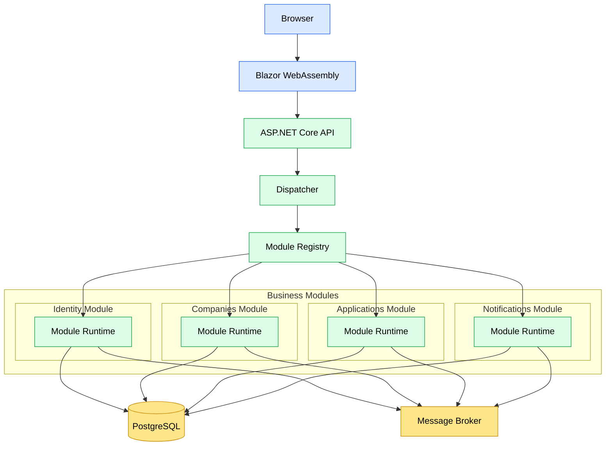
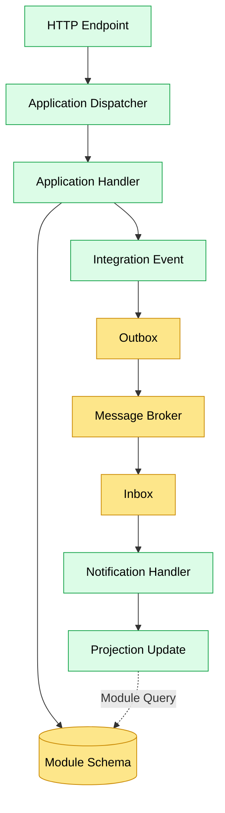
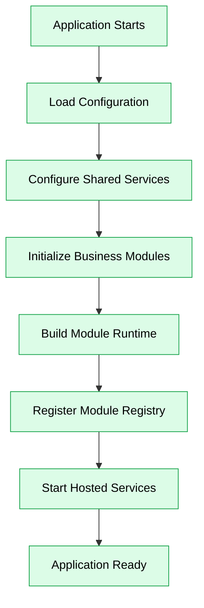
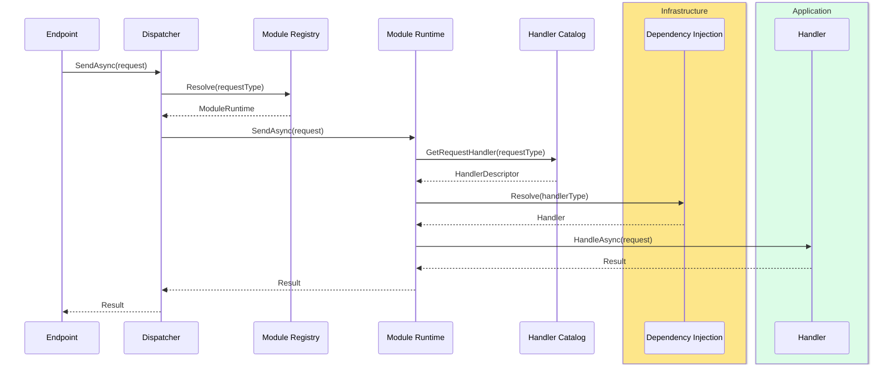
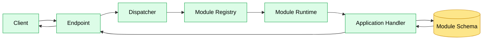
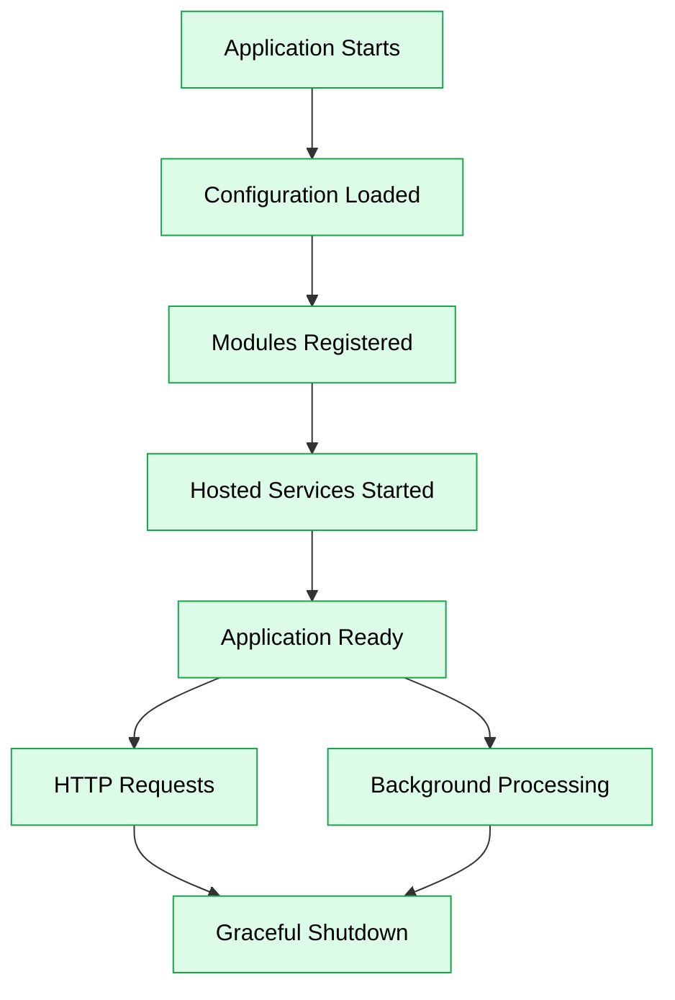

# Runtime

## Purpose

This document describes the runtime architecture of JobWize.

It explains how the application executes, how its components interact during runtime, and how the runtime architecture supports the modular monolith while remaining ready for future evolution.

Operational concerns such as containers, orchestration, CI/CD pipelines, cloud infrastructure, and deployment strategies are documented separately under `docs/devops`.

---

# Runtime Overview

At runtime, JobWize consists of two independent applications working together:

-   A **Blazor WebAssembly** frontend running in the user's browser.
-   An **ASP.NET Core API** hosting the backend and its business modules.

The backend executes as a single application containing multiple independent business modules. Each module owns its own business logic, data, and background processing while sharing the same application process.

The diagram below illustrates the runtime topology of the system.



Although the backend is deployed as a single executable, every module behaves as an independent component with clearly defined boundaries.

This separation allows the frontend and backend to evolve independently while enabling backend modules to evolve independently from one another. As the system grows, individual modules may eventually be extracted into separate services without affecting the frontend or the public API contracts.

The following diagram illustrates the internal runtime flow executed by every business module.



Application features execute synchronously through endpoints, the application dispatcher, and handlers, while communication between modules always occurs asynchronously through the Outbox, Message Broker, and Inbox.

When maintaining projections, notification handlers retrieve the authoritative state through **Module Queries** rather than relying solely on the payload contained within the integration event.

---

# Runtime Components

The runtime consists of the following primary components.

| Component              | Responsibility                                                                                  |
| ---------------------- | ----------------------------------------------------------------------------------------------- |
| **Browser**            | Executes the Blazor WebAssembly application.                                                    |
| **Blazor WebAssembly** | Provides the user interface and communicates with the backend through HTTP APIs.                |
| **ASP.NET Core API**   | Hosts the HTTP pipeline, dependency injection container, hosted services, and business modules. |
| **Business Modules**   | Execute application features while enforcing module boundaries and owning their data.           |
| **PostgreSQL**         | Stores module data, projections, Inbox, and Outbox tables.                                      |
| **Message Broker**     | Delivers integration events asynchronously between modules.                                     |
| **Hosted Services**    | Process Inbox, Outbox, and other asynchronous background tasks.                                 |
| **Dispatcher**         | Entry point for application requests.                                                           |
| **Module Registry**    | Resolves which module owns a request.                                                           |
| **Module Runtime**     | Executes requests belonging to a module.                                                        |

---

# Application Startup

The application follows a predictable startup sequence.



During startup the application:

1. Loads application configuration.
2. Configures dependency injection.
3. Registers every business module.
4. Starts all hosted background services.
5. Begins accepting incoming HTTP requests.

The startup sequence is coordinated through the application's composition root.

---

# Runtime Dispatch Pipeline

After the application has started, every synchronous request follows the same execution pipeline.

The Dispatcher acts as the single entry point for application requests. It first asks the Module Registry which business module owns the request type. The registry returns the corresponding Module Runtime, which resolves the appropriate handler from its Handler Catalog, creates the handler through the dependency injection container, and finally executes the request.

Because every module owns its own runtime, request execution remains fully encapsulated within the owning module while request routing remains centralized.



The Handler Catalog is created once during application startup from the module descriptor produced by the Handler Scanner. As a result, request execution requires no reflection or assembly scanning, relying only on dictionary lookups and dependency injection to locate and execute the correct handler.

---

# Request Lifecycle

A synchronous request follows the execution flow below.



HTTP endpoints remain intentionally lightweight.

Their responsibility is limited to receiving the request, invoking the application dispatcher, and returning the response.

The dispatcher resolves the owning module through the Module Registry, which forwards execution to the corresponding Module Runtime. The runtime resolves the appropriate handler and executes it within the module boundary. Business logic therefore remains encapsulated inside the owning module while request routing is coordinated centrally.

---

# Integration Event Lifecycle

Integration events follow a different execution path.

Rather than communicating directly with other modules, every integration event is delivered through the messaging infrastructure.

```mermaid
flowchart LR

    Handler["Application Handler"]

    Outbox["Outbox"]

    Broker["Message Broker"]

    Inbox["Inbox"]

    Notification["Notification Handler"]

    Projection["Projection Update"]

    Handler --> Outbox
    Outbox --> Broker
    Broker --> Inbox
    Inbox --> Notification
    Notification --> Projection

    classDef application fill:#dcfce7,stroke:#16a34a,color:#000;
    classDef infrastructure fill:#fde68a,stroke:#ca8a04,color:#000;

    class Handler,Notification,Projection application;
    class Outbox,Broker,Inbox infrastructure;
```



Even when both the publisher and subscriber execute inside the same application process, integration events always travel through the Outbox, Message Broker, and Inbox.

This guarantees identical communication semantics regardless of whether modules execute within the same process or are later deployed as independent services.

---

# Hosted Background Services

Each business module may register one or more hosted background services responsible for asynchronous processing.

Typical responsibilities include:

-   Processing the module's Outbox.
-   Processing the module's Inbox.
-   Executing scheduled background tasks when required.

As additional modules are introduced, each module remains responsible for its own background processing, allowing the runtime to grow without introducing centralized processing services.

Hosted services execute within the ASP.NET Core application process, allowing background processing to remain encapsulated inside each module while sharing the same runtime.

If a module is later extracted into an independent service, its hosted services move together with the module without requiring architectural changes.

# External Dependencies

The runtime currently depends on the following external services.

| Dependency         | Responsibility                                                               |
| ------------------ | ---------------------------------------------------------------------------- |
| **PostgreSQL**     | Persistent storage for business data, projections, Inbox, and Outbox tables. |
| **Message Broker** | Reliable asynchronous communication between business modules.                |

As the platform evolves, additional infrastructure services may be introduced, such as:

-   Object storage for uploaded files.
-   SMTP providers for email delivery.
-   External authentication providers.

These integrations remain infrastructure concerns and do not affect the internal architecture of the business modules.

---

# Configuration

Application configuration is loaded during startup through the ASP.NET Core configuration system.

Typical configuration includes:

-   Database connection strings.
-   Message broker settings.
-   Authentication settings.
-   External service configuration.
-   Environment-specific values.

Business modules consume configuration through abstractions and remain independent from the underlying configuration providers.

---

# Health Checks

The runtime exposes health endpoints that allow external systems to verify the operational state of the application.

Health checks may validate critical dependencies such as:

-   Database connectivity.
-   Message broker availability.
-   Other infrastructure services required for normal operation.

These endpoints support monitoring, automated deployments, and operational diagnostics while remaining independent from deployment-specific tooling.

---

# Scalability

The runtime architecture intentionally separates **logical module boundaries** from **deployment boundaries**.

Today, JobWize executes as a single deployable application.

```text
Browser

↓

Blazor WebAssembly

↓

ASP.NET Core API

├── Identity
├── Companies
├── Applications
└── Notifications
```

As the system evolves, individual modules may be extracted into independently deployable services.

```text
Browser

↓

Blazor WebAssembly

↓

API Gateway

├── Identity Service
├── Companies Service
├── Applications Service
└── Notifications Service
```

Because communication already occurs through module contracts, integration events, and asynchronous messaging, this evolution primarily affects deployment rather than application code.

A heavily used module can therefore be scaled independently without requiring additional instances of the entire application.

This architecture enables the system to evolve gradually from a modular monolith toward a distributed architecture when business requirements justify the additional operational complexity.

---

# Runtime Lifecycle

The application follows the lifecycle below.



During shutdown the runtime stops accepting new requests while allowing in-flight requests and background processing to complete before terminating.

This graceful shutdown process minimizes service interruption and helps preserve the consistency of ongoing operations.

---

# Runtime Principles

The runtime architecture follows these principles:

-   The frontend and backend execute as independent applications.
-   The backend is deployed as a single executable.
-   Business modules remain logically independent.
-   Request execution is module-aware and always routed through the owning module runtime.
-   Each module owns its own data and background processing.
-   Integration events always traverse the messaging infrastructure.
-   Background processing is encapsulated within individual modules.
-   External dependencies are accessed exclusively through infrastructure abstractions.
-   Logical module boundaries remain independent from deployment boundaries.
-   The runtime supports gradual evolution toward independently deployable services without requiring changes to business logic.

---

# Summary

The runtime architecture brings together every architectural concept introduced throughout this documentation.

The frontend and backend remain independently evolvable, business modules execute within a shared runtime while preserving strict boundaries, synchronous operations are routed through the application dispatcher, module registry, and module runtime before reaching the owning application handler, and asynchronous communication is performed through reliable messaging using the Outbox and Inbox patterns.

This separation of concerns allows the application to remain simple to develop and deploy today while providing a clear and incremental path toward independently scalable services as the platform grows.
