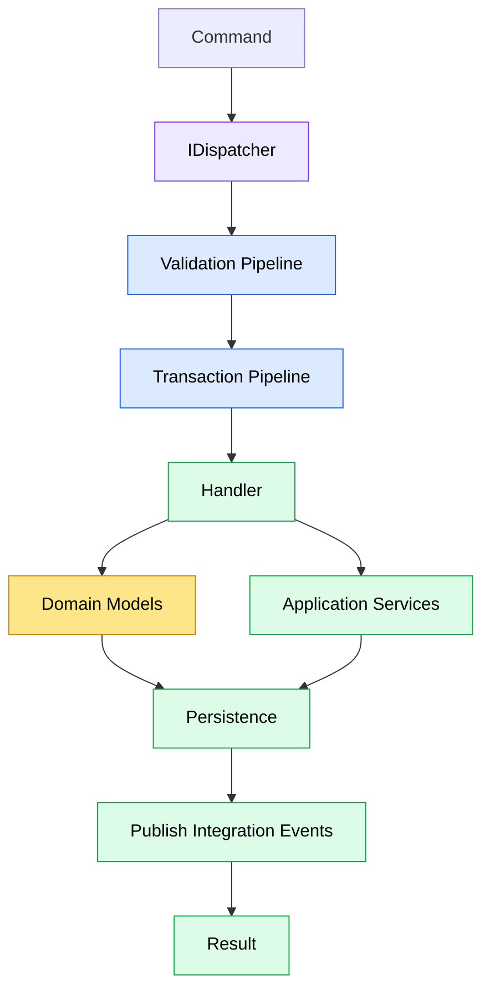

# Application Layer

## Purpose

The Application layer is responsible for executing business use cases.

It orchestrates Domain Models, coordinates infrastructure through abstractions, and produces application results.

The Application layer contains no transport concerns and does not implement business invariants.

---

# Responsibilities

The Application layer is responsible for:

-   Executing business use cases.
-   Loading Domain Models.
-   Coordinating multiple Domain Models when necessary.
-   Calling application services.
-   Persisting changes.
-   Publishing integration events.
-   Returning application results.

The Application layer is **not** responsible for:

-   HTTP concerns.
-   Database implementation details.
-   Business invariants.
-   Serialization.
-   External communication protocols.

---

# Request Execution

Application requests enter through the `IDispatcher`.

The Dispatcher abstracts the underlying execution mechanism.

Its responsibilities and communication strategies are described in **06 - Module Communication**.

---

# Use Case Lifecycle

Every command follows the same execution pipeline.



Queries follow the same lifecycle except that they do not execute inside a transaction and do not publish integration events.

---

# Use Cases

Each handler implements exactly one business use case.

Examples:

-   RegisterCandidate
-   Login
-   SuspendUser
-   CreateAdmin

Handlers should model business actions rather than generic CRUD operations.

---

# Handlers

Handlers orchestrate the execution of a use case.

Typical responsibilities include:

-   Loading Domain Models.
-   Coordinating multiple Domain Models.
-   Calling Domain behavior.
-   Calling application services.
-   Persisting changes.
-   Publishing integration events.
-   Returning a `Result`.

Handlers should never contain:

-   Business invariants.
-   HTTP concerns.
-   SQL.
-   Serialization logic.
-   Infrastructure-specific implementations.

---

# Validation

Validation is performed before the handler executes.

Validation verifies that a request is structurally valid.

Examples include:

-   Required fields.
-   Email format.
-   String length.
-   Numeric ranges.
-   Enumeration values.

Validation should not perform business rule verification.

Business rules belong to the Domain Model.

Examples that are **not** validation:

-   Email already exists.
-   User is already suspended.
-   Company has already been deleted.

---

# Domain Models

Business behavior belongs to Domain Models.

Handlers coordinate Domain Models but do not implement their business invariants.

When a business rule is violated, the Domain Model throws a `BusinessRuleViolationException`.

---

# Application Services

Some use cases require capabilities that do not naturally belong to a Domain Model.

Examples include:

-   Checking whether an email address already exists.
-   Password hashing.
-   Reading information from another module.
-   Accessing the current authenticated user.

These responsibilities belong to application services that are injected into the handler through abstractions.

---

# Transactions

Every command executes inside a single transaction.

The transaction encompasses:

-   The command handler.
-   All in-process integration event handlers triggered during execution.
-   Persistence of application data.

The transaction commits only after all in-process work completes successfully.

Queries execute without a transaction.

---

# Integration Events

Handlers may publish integration events through the `IDispatcher`.

Integration events are first processed by in-process handlers.

Once all in-process handlers complete successfully, the events are persisted to the Outbox for asynchronous delivery.

The complete event lifecycle is described in **07 - Event Processing**.

---

# Result

Every handler returns a `Result`.

A `Result` represents the outcome of the use case rather than the HTTP response.

Future versions may introduce additional result statuses, such as user confirmation, without changing handler implementations.

The API layer is responsible for translating application results into the appropriate HTTP responses.

---

# Errors

Expected failures are represented through predefined `Error` objects.

Each error has a globally unique code.

Example:

```text
identity.email_already_exists
```

Errors should be declared once and reused throughout the application.

---

# Exceptions

Exceptions represent situations that cannot be expressed as expected application results.

Typical examples include:

-   Business rule violations.
-   Infrastructure failures.
-   Unexpected application errors.

The API layer is responsible for translating exceptions into HTTP error responses.

---

# Pipeline Behaviors

Cross-cutting concerns are implemented through pipeline behaviors.

Examples include:

-   Validation.
-   Transactions.
-   Logging.
-   Metrics.

Business logic should never be implemented inside pipeline behaviors.

---

# Dependencies

The Application layer may depend on:

-   Domain.
-   Shared.
-   Contracts.

The Application layer must never depend on:

-   API.
-   Infrastructure.

---

# Design Principles

The Application layer follows these principles:

-   One handler per use case.
-   Handlers orchestrate rather than implement business rules.
-   Business behavior belongs to Domain Models.
-   Validation verifies structure, not business rules.
-   Expected outcomes return `Result`.
-   Unexpected situations raise exceptions.
-   Commands execute inside a single transaction.
-   Cross-cutting concerns belong to pipeline behaviors.
-   Communication with other modules occurs through abstractions.
