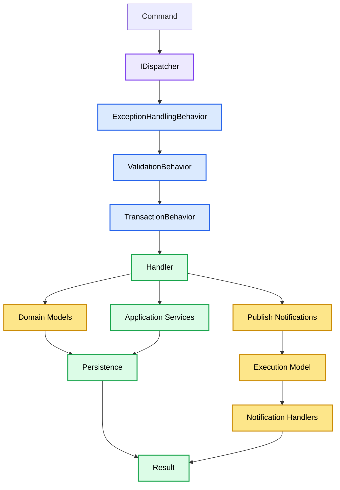

# Application Layer

## Purpose

The Application layer is responsible for executing business use cases.

It orchestrates Domain Models, coordinates infrastructure through abstractions, and produces application results.

The Application layer contains no transport concerns and does not implement business invariants.

---

# Responsibilities

The Application layer is responsible for:

-   Executing business use cases.
-   Loading Domain Models.
-   Coordinating multiple Domain Models when necessary.
-   Calling application services.
-   Persisting changes.
-   Publishing notifications.
-   Returning application results.

The Application layer is **not** responsible for:

-   HTTP concerns.
-   Database implementation details.
-   Business invariants.
-   Serialization.
-   External communication protocols.

---

# Request Processing

Application requests enter through the `IDispatcher`.

The Dispatcher abstracts the underlying execution mechanism.

Its responsibilities and communication strategies are described in **06 - Module Communication**.

---

# Use Case Lifecycle

Every command follows the same execution pipeline.


```mermaid
flowchart TD

    REQUEST["Command"]

    DISPATCHER["IDispatcher"]

    EXCEPTIONS["ExceptionHandlingBehavior"]

    VALIDATION["ValidationBehavior"]

    TRANSACTION["TransactionBehavior"]

    HANDLER["Handler"]

    SERVICES["Application Services"]

    DOMAIN["Domain Models"]

    PERSISTENCE["Persistence"]

    NOTIFICATIONS["Publish Notifications"]

    EXECUTION["Execution Model"]

    NHANDLERS["Notification Handlers"]

    RESULT["Result"]

    REQUEST --> DISPATCHER
    DISPATCHER --> EXCEPTIONS
    EXCEPTIONS --> VALIDATION
    VALIDATION --> TRANSACTION
    TRANSACTION --> HANDLER

    HANDLER --> DOMAIN
    HANDLER --> SERVICES

    DOMAIN --> PERSISTENCE
    SERVICES --> PERSISTENCE

    HANDLER --> NOTIFICATIONS
    NOTIFICATIONS --> EXECUTION
    EXECUTION --> NHANDLERS

    PERSISTENCE --> RESULT
    NHANDLERS --> RESULT

    classDef dispatcher fill:#ede9fe,stroke:#7c3aed,color:#000,stroke-width:2px;
    classDef pipeline fill:#dbeafe,stroke:#2563eb,color:#000,stroke-width:2px;
    classDef application fill:#dcfce7,stroke:#16a34a,color:#000,stroke-width:2px;
    classDef domain fill:#fde68a,stroke:#ca8a04,color:#000,stroke-width:2px;
    classDef runtime fill:#fde68a,stroke:#ca8a04,color:#000,stroke-width:2px;

    class DISPATCHER dispatcher;
    class EXCEPTIONS,VALIDATION,TRANSACTION pipeline;
    class HANDLER,SERVICES,PERSISTENCE,RESULT application;
    class DOMAIN domain;
    class NOTIFICATIONS,EXECUTION,NHANDLERS runtime;
```

Queries follow the same lifecycle except that they do not execute inside a transaction and do not publish notifications.

---

# Request Pipeline

Every request passes through a configurable pipeline before reaching its handler.

Pipeline behaviors encapsulate cross-cutting concerns independently of business logic. Each behavior has a single responsibility and may either continue execution or terminate the pipeline early.

The current pipeline consists of:

-   ExceptionHandlingBehavior
-   ValidationBehavior
-   TransactionBehavior

Additional behaviors, such as authorization, logging, metrics or caching, can be introduced without modifying existing handlers.

---

## ExceptionHandlingBehavior

`ExceptionHandlingBehavior` is the outermost application behavior. It catches unexpected exceptions raised while a use case is being dispatched, logs them, and returns the shared unexpected-failure `Result`.

This behavior does not replace ASP.NET Core exception handling. The API's global exception handler remains the final safety net for failures that occur outside the dispatcher scope.

---

## ValidationBehavior

Validation executes before any business logic.

Its responsibility is to verify that a request is structurally valid before the use case begins.

Typical validation rules include:

-   Required fields.
-   Email format.
-   String length.
-   Numeric ranges.
-   Enumeration values.

If validation fails:

-   The handler is never executed.
-   No transaction is started.
-   A failed `Result` containing all validation errors is returned.

Validation rules should only verify the structure of a request.

Business rules belong to the Domain Model.

Examples that are **not** validation:

-   Email already exists.
-   User is already suspended.
-   Company has already been deleted.

---

## TransactionBehavior

Every command executes inside a single transaction.

The transaction begins only after validation succeeds.

The transaction encompasses:

-   The command handler.
-   Persistence of application data.
-   All notification handlers executed by the configured Runtime Execution Model.

The transaction commits only after the entire in-process execution completes successfully.

If the handler returns a failed `Result`, or an exception is thrown, the transaction is rolled back.

Queries execute without a transaction.

---

# Use Cases

Each handler implements exactly one business use case.

Examples:

-   RegisterCandidate
-   Login
-   SuspendUser
-   CreateAdmin

Handlers should model business actions rather than generic CRUD operations.

---

# Handlers

Handlers orchestrate the execution of a use case.

Typical responsibilities include:

-   Loading Domain Models.
-   Coordinating multiple Domain Models.
-   Calling Domain behavior.
-   Calling application services.
-   Persisting changes.
-   Publishing notifications.
-   Returning a `Result`.

Handlers should never contain:

-   Business invariants.
-   HTTP concerns.
-   SQL.
-   Serialization logic.
-   Infrastructure-specific implementations.

---

# Domain Models

Business behavior belongs to Domain Models.

Handlers coordinate Domain Models but do not implement their business invariants.

Domain Models are responsible for protecting the consistency of the business model and enforcing business rules.

---

# Application Services

Some use cases require capabilities that do not naturally belong to a Domain Model.

Examples include:

-   Checking whether an email address already exists.
-   Password hashing.
-   Reading information from another module.
-   Accessing the current authenticated user.

These responsibilities belong to application services that are injected into the handler through abstractions.

---

# Notifications

Handlers publish notifications through `IDispatcher`.

The configured Runtime Execution Model determines how those notifications are processed.

For the Monolith Execution Model, notifications are executed immediately inside the current transaction.

Other execution models may persist notifications for asynchronous processing.

The complete event lifecycle is described in **07 - Event Processing**.

---

# Result

Every handler returns a `Result`.

A `Result` represents the outcome of the business use case rather than the transport protocol.

The Application layer never returns HTTP responses directly.

The API layer is responsible for translating application results into the appropriate HTTP responses.

Future versions may introduce additional result statuses without changing handler implementations.

---

# Errors

Expected failures are represented through predefined `Error` objects.

Each error contains:

-   A unique error code.
-   A human-readable message.
-   An error type.

Example:

```text
Identity.EmailAlreadyExists
```

Errors should be declared once and reused throughout the application.

---

# Exceptions

Exceptions represent situations that cannot be expressed as expected application results.

Typical examples include:

-   Infrastructure failures.
-   Unexpected runtime errors.
-   Invalid application state.
-   Programming errors.

Exceptions raised during dispatcher execution are converted into the shared unexpected-failure `Result` by `ExceptionHandlingBehavior`. Exceptions outside that scope are handled by the API's global exception handler. In both cases, clients receive the same safe problem-details error contract rather than exception details.

---

# Dependencies

The Application layer may depend on:

-   Domain.
-   Shared.
-   Contracts.

The Application layer must never depend on:

-   API.
-   Infrastructure.

---

# Design Principles

The Application layer follows these principles:

-   One handler per use case.
-   Handlers orchestrate rather than implement business rules.
-   Business behavior belongs to Domain Models.
-   Validation verifies structure, not business rules.
-   Commands are validated before execution.
-   Commands execute inside a single transaction.
-   Expected outcomes return `Result`.
-   Unexpected situations raise exceptions.
-   Cross-cutting concerns belong to pipeline behaviors.
-   Communication and notification publishing occur exclusively through Runtime abstractions.
