# DevOps Overview

## Purpose

This document provides an overview of the DevOps architecture and operational strategy used by JobWize.

It acts as the entry point for the DevOps documentation and explains how the different infrastructure documents fit together.

The objective is to help contributors understand how JobWize is built, deployed, monitored, and operated.

---

## DevOps Vision

JobWize follows a simple and professional DevOps approach.

The platform should be:

- Automated
- Reproducible
- Secure
- Observable
- Maintainable
- Scalable
- Documented

The infrastructure is designed before implementation so that every technical decision has a clear purpose.

---

## DevOps Responsibilities

The DevOps area covers:

- GitHub and GitLab integration
- CI/CD pipelines
- Docker image creation
- Container Registry
- Infrastructure provisioning
- Server configuration
- K3s deployment
- Environment management
- Monitoring
- Logging
- Alerting
- Backups
- Disaster recovery
- Secrets management
- Release operations

---

## High-Level Delivery Flow

```mermaid
flowchart LR
    Developer["Developer"]
    GitHub["GitHub<br/>Source of Truth"]
    Sync["GitHub Action<br/>Repository Sync"]
    GitLab["GitLab<br/>DevOps Platform"]
    Pipeline["GitLab CI/CD"]
    Runner["GitLab Runner<br/>DevOps Server"]
    Registry["GitLab Container Registry"]
    Staging["Staging Server"]
    Validation["Validation"]
    Production["Production Server"]
    Monitoring["Monitoring Server"]

    Developer --> GitHub
    GitHub --> Sync
    Sync --> GitLab
    GitLab --> Pipeline
    Pipeline --> Runner
    Runner --> Registry
    Registry --> Staging
    Staging --> Validation
    Validation --> Production
    Staging --> Monitoring
    Production --> Monitoring
```



---

## Target Infrastructure

JobWize uses four dedicated servers.

| Server | Main Responsibility |
|--------|---------------------|
| DevOps | CI/CD, automation and infrastructure management |
| Staging | Pre-production deployment and validation |
| Monitoring | Metrics, logs, alerts and backups |
| Production | Live application and production data |

This separation improves security, reliability, and maintainability.

---

## Environment Strategy

JobWize uses the following environments:

| Environment | Purpose |
|-------------|---------|
| Local | Daily development |
| Development | Optional shared integration environment |
| Staging | Pre-production validation |
| Production | Live platform |

For the MVP, the active environments are:

```text
Local
Staging
Production
```

The shared Development environment may be added later if the team grows.

---

## Documentation Structure

The DevOps documentation is organized in the following order:

```text
docs/devops/
├── 00-overview.md
├── 01-server-architecture.md
├── 02-server-specifications.md
├── 03-environments.md
├── 04-ci-cd-strategy.md
└── 05-monitoring-and-backup.md
```

---

## Document Guide

### `00-overview.md`

Provides the entry point for the DevOps documentation.

It explains the global DevOps vision, infrastructure model, delivery flow, and reading order.

---

### `01-server-architecture.md`

Answers:

> Where does JobWize run?

It explains:

- The four-server model
- The role of each server
- GitHub and GitLab responsibilities
- Deployment flow
- Network communication
- Security principles

---

### `02-server-specifications.md`

Answers:

> What does each server contain?

It explains:

- Operating system
- Installed tools
- Hosted services
- Minimum hardware
- Directory structure
- Network access
- Hostname conventions

---

### `03-environments.md`

Answers:

> Which environments exist and how are they separated?

It explains:

- Local environment
- Development environment
- Staging environment
- Production environment
- Configuration strategy
- Data isolation
- Environment promotion

---

### `04-ci-cd-strategy.md`

Answers:

> How does source code become a deployment?

It explains:

- GitHub to GitLab synchronization
- GitLab Runner
- Pipeline stages
- Docker image creation
- Container Registry
- Staging deployment
- Production approval
- Rollback strategy

---

### `05-monitoring-and-backup.md`

Answers:

> How do we keep JobWize healthy and recoverable?

It explains:

- Prometheus
- Grafana
- Loki
- AlertManager
- Metrics and logs
- Alerts
- PostgreSQL backups
- MinIO backups
- Restore procedures
- Basic disaster recovery

---

## DevOps Principles

The JobWize infrastructure follows these principles.

### Infrastructure as Code

Infrastructure and server configuration should be automated and version-controlled.

Main tools:

- Terraform
- Ansible
- Kubernetes manifests
- Helm

---

### Automation First

Repeated manual operations should be replaced by automation.

Examples:

- Server provisioning
- Software installation
- Application deployment
- Database backups
- Monitoring configuration

---

### Environment Isolation

Staging and production must use separate:

- Databases
- Secrets
- Storage
- Certificates
- Configuration
- Domains

Production data must never be used directly in staging or local development.

---

### Security by Default

The infrastructure should use:

- SSH key authentication
- Least privilege
- Protected CI/CD variables
- Kubernetes Secrets
- Private database access
- Encrypted communication
- Restricted production access

---

### Observability from the Beginning

Monitoring should not be added only after problems occur.

Every important service should expose:

- Health checks
- Metrics
- Structured logs
- Alerts

---

### Build Once, Deploy Many

The same validated Docker image should be promoted from staging to production.

Production should not rebuild a different image from the same source code.

---

### Documentation as Part of Delivery

Documentation must evolve with the implementation.

When the infrastructure changes, the related DevOps document must also be updated.

---

## Team Responsibilities

### Soufiane Rizk

DevOps Engineer, Open Source Maintainer, and Project Governance.

Main responsibilities:

- DevOps architecture
- Infrastructure operations
- GitHub and GitLab administration
- CI/CD
- Docker
- Terraform
- Ansible
- K3s
- Monitoring
- Backups
- Database operations
- Secrets management
- Deployment automation

### Ahmed Amine Abahmane

Software Architect and Full Stack Developer.

Main responsibilities:

- Software architecture
- Backend
- Frontend
- Database design
- API design
- Application health checks
- Application metrics
- Structured logs
- Database migration safety

Both maintainers review important changes together.

---

## Implementation Roadmap

After the DevOps documentation is approved, implementation follows this order:

```text
1. Local Docker environment
2. PostgreSQL, Redis and MinIO
3. Backend and frontend Dockerfiles
4. GitLab Runner
5. Initial GitLab pipeline
6. Staging K3s deployment
7. Monitoring stack
8. Backup automation
9. Production deployment
```

The implementation may evolve, but it should remain aligned with the documented architecture.

---

## Future Evolution

As JobWize grows, the DevOps platform may include:

- Multi-node Kubernetes clusters
- Managed PostgreSQL
- High availability
- Blue/Green deployment
- Canary releases
- Automated disaster recovery
- External backup storage
- Azure Key Vault
- Distributed tracing
- Multi-region production

These improvements are future options, not MVP requirements.

---

## Summary

The JobWize DevOps architecture provides a controlled path from source code to production:

```text
GitHub
    ↓
GitLab
    ↓
GitLab CI/CD
    ↓
GitLab Runner
    ↓
Docker Images
    ↓
Container Registry
    ↓
Staging
    ↓
Validation
    ↓
Production
    ↓
Monitoring and Backup
```

The documentation is intentionally simple and organized around five main topics:

- Server architecture
- Server specifications
- Environments
- CI/CD
- Monitoring and backups

This overview is the starting point for understanding how JobWize is deployed and operated.