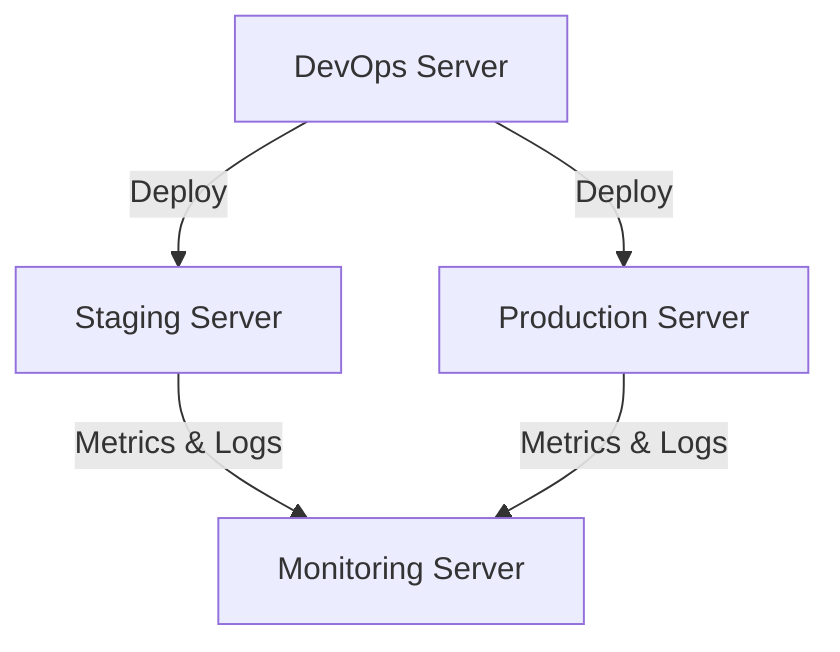

# Server Specifications

## Purpose

This document defines the technical specifications for each server used by the JobWize platform.

It describes the role, operating system, installed software, hosted services, network access, hardware recommendations, and directory structure for every server.

The objective is to provide a clear infrastructure blueprint before provisioning or deployment.

---

# Goals

The server infrastructure has been designed to:

- Clearly separate responsibilities
- Improve security
- Simplify maintenance
- Support CI/CD automation
- Provide a production-ready architecture
- Enable future scalability
- Follow DevOps best practices

---

# Infrastructure Summary

JobWize is built around four dedicated servers.

Each server has a single responsibility.

| Server | Primary Role | Public Access |
|----------|--------------|---------------|
| DevOps | Automation & CI/CD | No |
| Staging | Validation & Testing | Limited |
| Monitoring | Monitoring & Backups | No |
| Production | Live Application | Yes |

---

# Infrastructure Overview



---

# Server 1 — DevOps

## Purpose

The DevOps server automates the software delivery lifecycle.

It is responsible for building, testing, packaging, and deploying the application.

This server never hosts the JobWize application itself.

---

## Responsibilities

- Execute GitLab CI/CD pipelines
- Build Docker images
- Push images to GitLab Container Registry
- Deploy applications
- Manage Infrastructure as Code
- Execute automation scripts
- Connect securely to staging and production

---

## Installed Software

| Software | Purpose |
|-----------|----------|
| Ubuntu Server 24.04 LTS | Operating System |
| Git | Source Control |
| Docker Engine | Container Engine |
| Docker Compose | Local Container Orchestration |
| GitLab Runner | CI/CD Runner |
| Terraform | Infrastructure as Code |
| Ansible | Configuration Management |
| kubectl | Kubernetes CLI |
| Helm | Kubernetes Package Manager |
| Python | Automation Scripts |
| OpenSSH | Secure Remote Access |

---

## Minimum Hardware

| Resource | Recommendation |
|----------|----------------|
| CPU | 2 vCPU |
| RAM | 4 GB |
| Storage | 60 GB SSD |

---

## Directory Structure

```text
/opt/jobwize/

├── runner/
├── deployments/
├── terraform/
├── ansible/
├── scripts/
└── logs/
```

---

## Network Access

Allowed Connections

```text
GitHub

↓

GitLab

↓

Staging Server

↓

Production Server
```

SSH access only.

No public web services are exposed.

---

# Server 2 — Staging

## Purpose

The staging server hosts the pre-production environment.

Every new release is deployed and validated here before reaching production.

---

## Responsibilities

- Host the staging application
- Validate deployments
- Perform integration testing
- Support User Acceptance Testing (UAT)

---

## Hosted Services

| Service | Purpose |
|----------|----------|
| Frontend | Blazor WebAssembly |
| Backend API | ASP.NET Core |
| PostgreSQL | Database |
| Redis | Distributed Cache |
| MinIO | Object Storage |

---

## Installed Software

| Software | Purpose |
|-----------|----------|
| Ubuntu Server 24.04 LTS | Operating System |
| K3s | Kubernetes Distribution |
| Traefik | Ingress Controller |
| Cert-Manager | SSL Certificates |
| Docker | Container Runtime |

---

## Minimum Hardware

| Resource | Recommendation |
|----------|----------------|
| CPU | 4 vCPU |
| RAM | 8 GB |
| Storage | 120 GB SSD |

---

## Directory Structure

```text
/opt/jobwize/

├── frontend/
├── backend/
├── database/
├── storage/
├── manifests/
└── logs/
```

---

## Network Access

Accepts deployments only from:

```text
DevOps Server
```

Exports metrics and logs to:

```text
Monitoring Server
```

---

# Server 3 — Monitoring

## Purpose

The monitoring server provides complete observability for the platform.

It collects metrics, logs, alerts, and stores backup-related information.

---

## Responsibilities

- Collect system metrics
- Collect application metrics
- Collect centralized logs
- Display dashboards
- Send alerts
- Monitor infrastructure health
- Execute backup tasks

---

## Installed Software

| Software | Purpose |
|-----------|----------|
| Ubuntu Server 24.04 LTS | Operating System |
| Prometheus | Metrics Collection |
| Grafana | Dashboards |
| Loki | Log Aggregation |
| AlertManager | Alert Management |
| Node Exporter | Server Metrics |

---

## Minimum Hardware

| Resource | Recommendation |
|----------|----------------|
| CPU | 2 vCPU |
| RAM | 4 GB |
| Storage | 80 GB SSD |

---

## Directory Structure

```text
/opt/monitoring/

├── prometheus/
├── grafana/
├── loki/
├── alerts/
└── backups/
```

---

## Network Access

Receives metrics from:

```text
Staging Server

Production Server
```

No public access.

Only administrators can access dashboards.

---

# Server 4 — Production

## Purpose

The production server hosts the live JobWize platform.

It serves real users and stores production data.

---

## Responsibilities

- Run the production application
- Serve user requests
- Store production data
- Ensure service availability
- Maintain high reliability

---

## Hosted Services

| Service | Purpose |
|----------|----------|
| Frontend | Blazor WebAssembly |
| Backend API | ASP.NET Core |
| PostgreSQL | Database |
| Redis | Distributed Cache |
| MinIO | Object Storage |

---

## Installed Software

| Software | Purpose |
|-----------|----------|
| Ubuntu Server 24.04 LTS | Operating System |
| K3s | Kubernetes Distribution |
| Traefik | Ingress Controller |
| Cert-Manager | SSL Certificates |
| Docker | Container Runtime |

---

## Minimum Hardware

| Resource | Recommendation |
|----------|----------------|
| CPU | 4 vCPU |
| RAM | 8 GB |
| Storage | 120 GB SSD |

---

## Directory Structure

```text
/opt/jobwize/

├── frontend/
├── backend/
├── database/
├── storage/
├── manifests/
└── logs/
```

---

## Network Access

Accessible by users through HTTPS.

Deployment access is allowed only from the DevOps Server.

Metrics and logs are exported to the Monitoring Server.

---

# Operating System

All servers use the same operating system.

| Operating System | Version |
|------------------|----------|
| Ubuntu Server | 24.04 LTS |

Using a common operating system simplifies:

- Automation
- Maintenance
- Package Management
- Security Updates
- Troubleshooting

---

# Hostname Convention

| Server | Hostname |
|----------|-----------|
| DevOps | jobwize-devops |
| Staging | jobwize-staging |
| Monitoring | jobwize-monitoring |
| Production | jobwize-production |

---

# Network Principles

The infrastructure follows several networking rules.

- Only the Production Server is publicly accessible.
- Databases are never exposed to the Internet.
- SSH access is restricted.
- Monitoring communicates only with required services.
- Deployments originate only from the DevOps Server.
- All communication uses encrypted protocols whenever possible.

---

# Security Principles

The infrastructure follows a secure-by-default approach.

- SSH Key Authentication
- Principle of Least Privilege
- Environment Isolation
- Private Internal Services
- Secrets stored outside the repository
- GitLab CI/CD Variables
- Kubernetes Secrets
- Regular Security Updates
- Infrastructure as Code

---

# Why This Architecture?

The four-server architecture separates responsibilities across the platform.

This design provides several benefits:

- Better security through isolation
- Easier maintenance
- Independent scaling
- Safer deployments
- Simplified monitoring
- Clear operational responsibilities

Although this architecture is designed for the MVP, it also provides a strong foundation for future growth.

---

# Future Improvements

As JobWize evolves, the infrastructure may include:

- Multi-node Kubernetes clusters
- High Availability PostgreSQL
- Dedicated Database Server
- Load Balancer
- Reverse Proxy
- CDN
- Object Storage Clustering
- Automated Disaster Recovery
- Multi-region Deployment
- Cloud Secret Management

---

# Summary

JobWize uses four dedicated servers.

| Server | Main Responsibility |
|----------|---------------------|
| DevOps | Build, Deploy and Automation |
| Staging | Validation and Testing |
| Monitoring | Metrics, Logs, Alerts and Backups |
| Production | Live Application |

Each server has a clearly defined role, making the infrastructure easier to manage, more secure, and ready for future expansion.