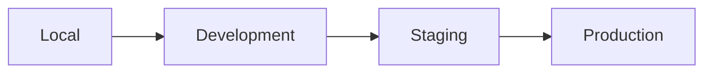

# Environments

## Purpose

This document describes the different environments used throughout the JobWize software lifecycle.

Each environment has a specific purpose and configuration, allowing the team to develop, test, validate, and deploy the application safely.

The objective is to ensure consistency across all environments while protecting production from unintended changes.

---

# Goals

The environment strategy is designed to:

- Separate development from production
- Validate changes before release
- Protect production data
- Simplify deployments
- Support CI/CD automation
- Maintain configuration consistency

---

# Environment Overview

JobWize uses four environments.

| Environment | Purpose | Audience |
|--------------|----------|----------|
| Local | Developer workstation | Developers |
| Development | Shared development environment (optional) | Development Team |
| Staging | Pre-production validation | Developers & QA |
| Production | Live platform | End Users |

---

# Environment Lifecycle



Every feature follows this progression before reaching production.

---

# Local Environment

## Purpose

The Local environment is used for daily development.

Every developer works locally before pushing changes to GitHub.

---

## Characteristics

- Runs on the developer's machine
- Fast feedback loop
- Debugging enabled
- Local database
- Local Docker containers
- Development configuration

---

## Main Components

- Frontend
- Backend API
- PostgreSQL
- Redis
- MinIO

---

## Deployment

Deployment is performed manually by the developer.

Example:

```bash
docker compose up
```

---

## Data

Local data is disposable.

Developers may reset or recreate the database at any time.

---

# Development Environment

## Purpose

The Development environment is a shared integration environment.

It is optional for the MVP but has been included to support future team growth.

It allows multiple developers to validate features together before staging.

---

## Characteristics

- Shared by the development team
- Uses development configuration
- Contains test data
- Connected to CI pipelines

---

## Data

Development data should never contain production information.

---

# Staging Environment

## Purpose

The Staging environment is an exact copy of production whenever possible.

Every release must be deployed here before production.

---

## Characteristics

- Mirrors production configuration
- Used for integration testing
- Used for User Acceptance Testing (UAT)
- Protected environment

---

## Hosted Services

- Frontend
- Backend API
- PostgreSQL
- Redis
- MinIO

---

## Deployment

Deployment is performed automatically by GitLab CI/CD.

Only validated releases continue to production.

---

## Data

Uses staging-only databases and storage.

Production data must never be used directly.

---

# Production Environment

## Purpose

The Production environment hosts the live JobWize application.

It serves real users and stores production data.

---

## Characteristics

- High availability
- Stable configuration
- Secure environment
- Continuous monitoring
- Automated backups

---

## Hosted Services

- Frontend
- Backend API
- PostgreSQL
- Redis
- MinIO

---

## Deployment

Production deployments occur only after successful validation in the Staging environment.

Deployments are fully automated through GitLab CI/CD.

---

## Data

Production contains real user data.

All operations must prioritize security, integrity, and availability.

---

# Environment Comparison

| Feature | Local | Development | Staging | Production |
|----------|-------|-------------|----------|------------|
| Developers | ✅ | ✅ | Limited | ❌ |
| Real Users | ❌ | ❌ | ❌ | ✅ |
| Test Data | ✅ | ✅ | ✅ | ❌ |
| Production Data | ❌ | ❌ | ❌ | ✅ |
| Debug Mode | ✅ | ✅ | ❌ | ❌ |
| Automatic Deployment | ❌ | ✅ | ✅ | ✅ |
| Monitoring | Optional | Basic | Full | Full |
| Backup | Optional | Optional | Yes | Yes |

---

# Configuration Strategy

Each environment has its own configuration.

Examples include:

- Database connection strings
- API endpoints
- Secrets
- Domain names
- Certificates
- Logging levels

Environment-specific values should never be stored directly in the source code.

Configuration should be managed through:

- Local `.env` files
- GitLab CI/CD Variables
- Kubernetes Secrets
- Configuration files

---

# Security Principles

Each environment must remain isolated.

Key principles include:

- Separate databases
- Separate object storage
- Separate secrets
- Separate SSL certificates
- Restricted production access
- Least privilege access

---

# Environment Promotion

Application versions move through environments using a controlled promotion process.

```mermaid
flowchart LR

    Developer

    -->

    Local

    -->

    GitHub

    -->

    GitLab CI/CD

    -->

    Development

    -->

    Staging

    -->

    Validation

    -->

    Production
```

This workflow ensures every release is validated before reaching end users.

---

# Best Practices

- Never develop directly in Production.
- Validate every release in Staging.
- Keep environments as similar as possible.
- Never reuse production secrets outside Production.
- Automate deployments whenever possible.
- Monitor all non-local environments.

---

# Future Improvements

As JobWize grows, the environment strategy may include:

- Feature Preview Environments
- Performance Testing Environment
- Disaster Recovery Environment
- Multi-region Production
- Blue/Green Deployments
- Canary Releases

---

# Summary

JobWize follows a four-environment strategy.

| Environment | Responsibility |
|--------------|----------------|
| Local | Development |
| Development | Team Integration |
| Staging | Validation |
| Production | Live Platform |

This strategy provides a safe and structured path from development to production while supporting automation, testing, and operational reliability.