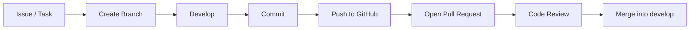
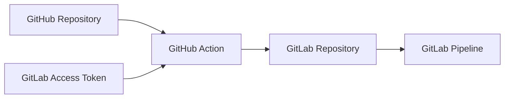
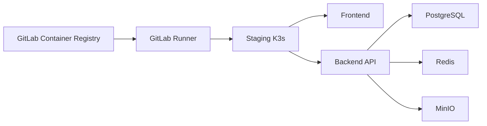
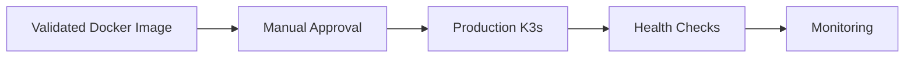
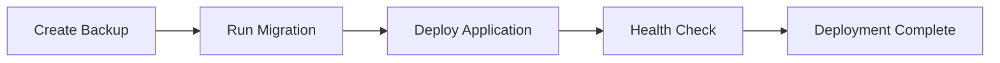
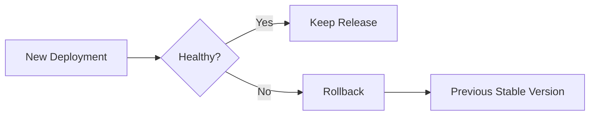

# CI/CD Strategy

## Purpose

This document describes the Continuous Integration and Continuous Deployment strategy used by JobWize.

It explains how source code moves from GitHub to GitLab, how the application is built and tested, how Docker images are created, and how releases are deployed to staging and production.

The objective is to provide a clear and controlled delivery process before implementing the GitLab pipeline.

---

## Goals

The JobWize CI/CD strategy is designed to:

- Automate build and testing
- Detect problems early
- Keep deployments repeatable
- Protect staging and production
- Produce versioned Docker images
- Reduce manual deployment steps
- Provide traceability for every release
- Support safe promotion from staging to production

---

## Platform Responsibilities

JobWize uses GitHub and GitLab for different purposes.

| Platform | Responsibility |
|----------|----------------|
| GitHub | Source of truth, Pull Requests, reviews, Issues and public documentation |
| GitLab | CI/CD pipelines, Container Registry, environments, variables and deployments |
| DevOps Server | Executes CI/CD jobs through GitLab Runner |

---

## High-Level CI/CD Flow

```mermaid
flowchart LR
    Developer["Developer"]
    Feature["Feature Branch"]
    PR["Pull Request"]
    GitHub["GitHub<br/>Source of Truth"]
    Sync["GitHub Action<br/>Repository Sync"]
    GitLab["GitLab<br/>DevOps Platform"]
    Runner["GitLab Runner<br/>DevOps Server"]
    Build["Build"]
    Test["Tests"]
    Analysis["Static Analysis"]
    Docker["Docker Build"]
    Registry["GitLab Container Registry"]
    Staging["Deploy to Staging"]
    Validation["Validation"]
    Production["Deploy to Production"]
    Monitoring["Monitoring"]

    Developer --> Feature
    Feature --> PR
    PR --> GitHub
    GitHub --> Sync
    Sync --> GitLab
    GitLab --> Runner
    Runner --> Build
    Build --> Test
    Test --> Analysis
    Analysis --> Docker
    Docker --> Registry
    Registry --> Staging
    Staging --> Validation
    Validation --> Production
    Production --> Monitoring
```



---

## Source Control Workflow

All source code changes begin in GitHub.

The standard workflow is:



Direct pushes to `main` and `develop` are not allowed.

---

## Branch Strategy

| Branch | Purpose |
|--------|---------|
| `main` | Stable production-ready code |
| `develop` | Integration branch for active development |
| `feature/*` | New application features |
| `bugfix/*` | Non-critical bug fixes |
| `hotfix/*` | Urgent production fixes |
| `docs/*` | Documentation changes |
| `infra/*` | Infrastructure changes |
| `ci/*` | CI/CD changes |

---

## GitHub to GitLab Synchronization

GitHub is the source of truth.

After a change is pushed or merged, a GitHub Actions workflow synchronizes the repository with GitLab.



The synchronization token is stored as a GitHub repository secret and must never be committed to the repository.

---

## GitLab Runner

The GitLab Runner is installed on the DevOps server.

GitLab manages the pipeline, while the Runner executes the actual jobs.

The Runner may execute commands such as:

```text
dotnet restore
dotnet build
dotnet test
docker build
docker push
kubectl apply
helm upgrade
terraform plan
ansible-playbook
```

The Runner must use restricted credentials and follow the principle of least privilege.

---

## Pipeline Stages

The initial JobWize pipeline uses the following stages:

```text
Validate
   ↓
Build
   ↓
Test
   ↓
Analyze
   ↓
Package
   ↓
Publish
   ↓
Deploy Staging
   ↓
Validate Staging
   ↓
Deploy Production
```

---

## Stage 1 — Validate

The validation stage checks the repository before building.

Possible checks include:

- Required files exist
- Configuration syntax is valid
- Dockerfiles are valid
- Kubernetes manifests are valid
- Terraform formatting is valid
- No obvious secrets are committed

This stage should fail quickly if the repository is incorrectly configured.

---

## Stage 2 — Build

The build stage compiles the application.

### Backend

```text
dotnet restore
dotnet build
```

### Frontend

The frontend build process will depend on the final Blazor project structure.

The build stage must produce repeatable results.

---

## Stage 3 — Test

The test stage verifies application behavior.

It may include:

- Unit tests
- Integration tests
- Architecture tests
- Validation tests

Example:

```text
dotnet test
```

A failed test must stop the pipeline.

---

## Stage 4 — Static Analysis

Static analysis checks code quality and security before packaging.

Possible tools include:

- SonarQube
- `dotnet format`
- Dependency vulnerability scanning
- Trivy
- Secret scanning

For the MVP, these checks can be introduced gradually.

---

## Stage 5 — Docker Build

The application is packaged into Docker images.

Initial images may include:

```text
jobwize-frontend
jobwize-backend
```

Future workers may include:

```text
jobwize-worker
```

Each image must be tagged clearly.

---

## Image Tagging Strategy

Recommended Docker tags:

| Tag | Meaning |
|-----|---------|
| Commit SHA | Exact source version |
| Branch name | Latest branch image |
| `staging` | Current staging release |
| Version tag | Released version |
| `latest` | Latest stable production release |

Examples:

```text
registry.gitlab.com/jobwize/jobwize/backend:8e1a19a
registry.gitlab.com/jobwize/jobwize/backend:staging
registry.gitlab.com/jobwize/jobwize/backend:v0.1.0
registry.gitlab.com/jobwize/jobwize/backend:latest
```

Production should use immutable version tags or commit SHA tags whenever possible.

---

## Stage 6 — Container Registry

Docker images are pushed to the GitLab Container Registry.

The Registry provides:

- Centralized image storage
- Authentication
- Versioned images
- Pipeline integration
- Deployment traceability

Registry credentials must be stored as GitLab CI/CD variables.

---

## Stage 7 — Staging Deployment

New validated images are deployed to the staging server first.



Staging deployment may be automatic after successful build, tests, and analysis.

---

## Staging Validation

Before production promotion, the team validates staging.

Validation may include:

- Application starts successfully
- Health checks pass
- Database migrations succeed
- Login works
- Main user journeys work
- Logs contain no critical errors
- Metrics are available
- Frontend can communicate with the backend

Production deployment must not continue if staging validation fails.

---

## Stage 8 — Production Deployment

Production receives only a release already validated in staging.

The preferred approach is to promote the same Docker image rather than rebuild it.



For the MVP, production deployment should require manual approval.

This prevents accidental releases.

---

## Deployment Rules by Branch

| Branch or Tag | Pipeline Behavior |
|---------------|-------------------|
| Feature branch | Validate, build and test |
| `develop` | Validate, build, test, publish and deploy to staging |
| `main` | Validate stable release and prepare production deployment |
| Version tag | Publish release image and deploy to production after approval |
| Hotfix branch | Validate and follow expedited review process |

---

## Recommended Trigger Strategy

### Feature Branches

Run:

- Validation
- Build
- Tests
- Static analysis

Do not deploy.

### Develop Branch

Run:

- Validation
- Build
- Tests
- Static analysis
- Docker build
- Registry push
- Staging deployment

### Main Branch

Run:

- Full validation
- Stable image publication
- Production deployment preparation

### Version Tags

Run:

- Release publication
- Production deployment
- Release notes

---

## Environment Variables and Secrets

The pipeline requires environment-specific configuration.

Examples include:

- Database connection strings
- Registry credentials
- SSH credentials
- Kubernetes configuration
- API secrets
- JWT configuration
- MinIO credentials
- Domain names

Secrets must be stored in GitLab CI/CD Variables.

Recommended scopes:

| Variable Type | Environment |
|---------------|-------------|
| Shared non-secret values | Global |
| Staging secrets | Staging only |
| Production secrets | Production only |
| Deployment credentials | Protected variables |

Production secrets must be protected and masked.

---

## Protected Branches and Environments

The following should be protected:

- `main`
- `develop`
- Production environment
- Production deployment variables
- Release tags

Only authorized maintainers should be allowed to trigger or approve production deployment.

---

## Database Migrations

Database migrations must be controlled by the pipeline.

Recommended sequence:



Migration rules:

- Test migrations in staging first
- Back up production before risky migrations
- Avoid destructive changes without a rollback plan
- Keep migrations version-controlled
- Stop deployment if migration fails

---

## Health Checks

After deployment, the pipeline should verify service health.

Possible checks:

- Frontend returns HTTP 200
- Backend health endpoint succeeds
- PostgreSQL is reachable
- Redis is reachable
- MinIO is reachable
- Kubernetes pods are ready
- Ingress route is available

A failed health check should mark the deployment as failed.

---

## Rollback Strategy

If a deployment fails, the team must be able to restore the previous stable version.

Rollback may include:

- Redeploying the previous Docker image
- Reverting Kubernetes or Helm release
- Restoring the previous configuration
- Restoring the database when required



The rollback process will be refined during implementation.

---

## Pipeline Notifications

The team should be informed when important pipeline events occur.

Notifications may include:

- Pipeline failure
- Staging deployment success
- Production approval required
- Production deployment success
- Rollback triggered
- Security scan failure

Initial notifications may use email. Slack or another collaboration tool may be added later.

---

## Release Strategy

JobWize follows Semantic Versioning:

```text
MAJOR.MINOR.PATCH
```

Examples:

```text
0.1.0
0.2.0
1.0.0
1.0.1
```

A release should include:

- Version tag
- Docker image tag
- Changelog update
- GitHub release
- GitLab release metadata
- Production deployment record

---

## Security Principles

The CI/CD platform follows these security principles:

- Never store secrets in source control
- Use protected and masked CI/CD variables
- Restrict production deployment permissions
- Use least-privilege deployment credentials
- Scan dependencies and container images
- Avoid privileged runners where possible
- Rotate tokens and credentials
- Keep Runner and build tools updated
- Review pipeline changes through Pull Requests

---

## Observability and Traceability

Every deployment should be traceable.

The team should be able to identify:

- Git commit
- Pull Request
- Pipeline
- Docker image
- Deployment time
- Environment
- Person who approved production
- Application version

This traceability helps with troubleshooting, auditing, and rollback.

---

## Initial MVP Pipeline

The first implementation should remain simple.

Recommended MVP stages:

```text
build
test
docker-build
push-registry
deploy-staging
deploy-production
```

The following can be added later:

- SonarQube
- Trivy scanning
- Automated integration tests
- Performance tests
- Blue/Green deployment
- Canary deployment
- Automated rollback

---

## Future Improvements

As JobWize grows, the CI/CD process may include:

- Review environments
- Parallel jobs
- Pipeline caching
- Automated database migration validation
- Blue/Green deployments
- Canary releases
- Software Bill of Materials
- Image signing
- Policy as Code
- Automated release notes
- Full DevSecOps scanning

---

## Summary

JobWize uses GitHub for source control and collaboration, while GitLab manages build, test, packaging, registry, and deployment automation.

The delivery process follows this path:

```text
Developer
    ↓
GitHub Pull Request
    ↓
GitHub to GitLab Synchronization
    ↓
GitLab Pipeline
    ↓
GitLab Runner
    ↓
Build and Test
    ↓
Docker Image
    ↓
GitLab Container Registry
    ↓
Staging Deployment
    ↓
Validation
    ↓
Production Approval
    ↓
Production Deployment
    ↓
Monitoring
```

This strategy provides a controlled, repeatable, and secure path from source code to production.