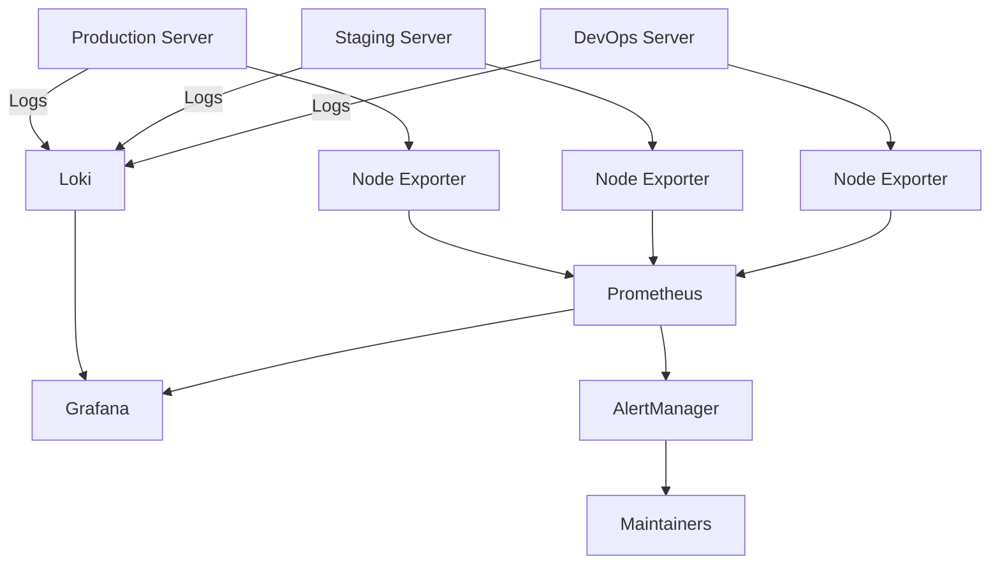
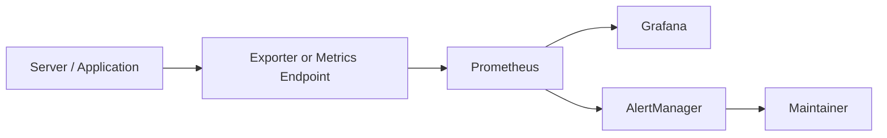
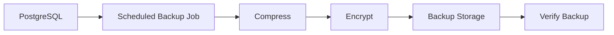
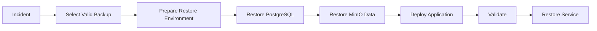

# Monitoring and Backup Strategy

## Purpose

This document defines the monitoring, logging, alerting, backup, restore, and basic disaster recovery strategy for JobWize.

The objective is to ensure that the platform is:

- Observable
- Reliable
- Recoverable
- Secure
- Easy to troubleshoot

This document describes the target design. The exact implementation may evolve as the platform grows.

---

## Goals

The monitoring and backup strategy is designed to:

- Detect infrastructure problems early
- Detect application failures
- Centralize logs
- Provide useful dashboards
- Alert maintainers when action is required
- Protect PostgreSQL data
- Protect MinIO documents
- Protect important configuration
- Verify that backups can be restored
- Reduce downtime after incidents

---

## High-Level Architecture

JobWize uses a dedicated Monitoring Server.

The Monitoring Server observes the DevOps, Staging, and Production servers.



---

## Monitoring Components

| Component | Responsibility |
|-----------|----------------|
| Prometheus | Collect and store metrics |
| Grafana | Display dashboards |
| Loki | Centralize logs |
| AlertManager | Manage and send alerts |
| Node Exporter | Expose Linux server metrics |
| Application Metrics | Expose backend and business metrics |
| K3s Metrics | Expose cluster and workload health |

---

## Prometheus

Prometheus collects metrics from servers, applications, and Kubernetes workloads.

It uses a pull-based model and periodically scrapes configured endpoints.

### Main responsibilities

- Collect infrastructure metrics
- Collect application metrics
- Collect Kubernetes metrics
- Store time-series data
- Evaluate alerting rules
- Send alerts to AlertManager

### Example targets

- DevOps Server
- Staging Server
- Production Server
- Backend API
- PostgreSQL exporter
- Redis exporter
- K3s cluster metrics

---

## Grafana

Grafana provides dashboards for infrastructure and application health.

### Initial dashboards

- Server overview
- CPU and memory usage
- Disk usage
- Network activity
- K3s cluster health
- Pod and container status
- Backend API performance
- PostgreSQL health
- Redis health
- Deployment status

### Dashboard principles

- Keep dashboards simple
- Show actionable information
- Separate staging from production
- Use clear names
- Avoid unnecessary panels
- Review dashboards regularly

---

## Loki

Loki centralizes logs from the platform.

### Log sources

- Backend API logs
- Frontend hosting logs
- K3s workload logs
- PostgreSQL logs
- Redis logs
- MinIO logs
- System logs
- GitLab Runner logs
- Deployment logs

### Log labels

Logs should include useful labels such as:

```text
environment
server
service
application
namespace
pod
severity
```

These labels make it easier to search and filter logs.

---

## AlertManager

AlertManager receives alerts from Prometheus and sends notifications to maintainers.

### Initial notification channels

- Email
- GitLab notifications when appropriate

Future channels may include:

- Slack
- Microsoft Teams
- PagerDuty
- SMS

### Alert principles

Alerts should be:

- Actionable
- Clear
- Prioritized
- Environment-aware
- Limited to meaningful events

Too many alerts create noise and reduce trust in the monitoring system.

---

## Monitoring Flow



---

## Infrastructure Metrics

The following server metrics should be monitored:

### CPU

- Current CPU usage
- Load average
- Sustained high CPU usage

### Memory

- Used memory
- Available memory
- Swap usage
- Out-of-memory events

### Disk

- Disk usage
- Available storage
- Disk input/output
- Filesystem errors

### Network

- Network traffic
- Connection errors
- Packet loss where available

### Server availability

- Server reachable
- Exporter reachable
- Important service status

---

## Kubernetes and K3s Metrics

For staging and production, monitor:

- Node availability
- Pod status
- Pod restarts
- Deployment readiness
- Failed workloads
- CPU usage by workload
- Memory usage by workload
- Persistent volume capacity
- Ingress availability
- Certificate status

---

## Application Metrics

The backend should expose health and performance metrics.

### Initial metrics

- HTTP request count
- HTTP response status
- Request duration
- Error rate
- Active requests
- Authentication failures
- Database query duration
- Background job status

Future business metrics may include:

- Applications created
- Interviews scheduled
- Follow-ups completed
- Active users

Business metrics must not expose personal or sensitive user data.

---

## Health Checks

The platform should expose health endpoints.

Example endpoints:

```text
/health
/health/live
/health/ready
```

### Liveness check

Confirms that the process is running.

### Readiness check

Confirms that the service is ready to receive traffic.

It may verify dependencies such as:

- PostgreSQL
- Redis
- MinIO

Health checks are used by:

- K3s
- CI/CD pipelines
- Monitoring
- Deployment validation

---

## Initial Alerts

The first alert rules should remain simple and useful.

| Alert | Example Condition |
|-------|-------------------|
| Server unavailable | Target unreachable |
| High CPU usage | CPU above threshold for a sustained period |
| High memory usage | Memory above threshold |
| Low disk space | Disk usage above threshold |
| Pod unavailable | Required pod not ready |
| Repeated pod restarts | Restart count increasing |
| Backend unavailable | Health endpoint failing |
| PostgreSQL unavailable | Database exporter or check failing |
| Redis unavailable | Redis check failing |
| MinIO unavailable | Storage check failing |
| High API error rate | Too many HTTP 5xx responses |
| Certificate expiration | Certificate nearing expiration |
| Backup failure | Backup job unsuccessful |

Thresholds should be adjusted after observing real platform behavior.

---

## Alert Severity

Alerts should be classified by severity.

| Severity | Meaning |
|----------|---------|
| Info | Informational event |
| Warning | Needs attention soon |
| Critical | Immediate action required |

Examples:

```text
Warning:
Disk usage above 80%

Critical:
Production backend unavailable
```

---

## Environment Separation

Monitoring data must clearly distinguish environments.

Recommended labels:

```text
environment="staging"
environment="production"
environment="devops"
```

Production alerts should have higher priority than staging alerts.

Staging incidents should not trigger the same escalation level as production incidents.

---

## Backup Scope

JobWize backups should protect the following areas:

- PostgreSQL databases
- MinIO documents
- Important configuration
- Kubernetes manifests
- Terraform state
- Monitoring configuration
- Grafana dashboards
- Alert rules

Source code is already protected through GitHub and GitLab.

---

## PostgreSQL Backup Strategy

PostgreSQL stores critical application data.

### Initial strategy

- Daily logical backup
- Additional backup before risky production migrations
- Encrypted backup storage
- Separate staging and production backups
- Automatic retention cleanup
- Regular restore tests

### Example workflow



### Backup naming

Example:

```text
jobwize-production-postgresql-2026-07-14-020000.sql.gz
jobwize-staging-postgresql-2026-07-14-020000.sql.gz
```

Backup names should contain:

- Project
- Environment
- Service
- Date
- Time

---

## MinIO Backup Strategy

MinIO stores uploaded documents.

These may include:

- Resumes
- Cover letters
- Attachments
- Future application documents

### Initial strategy

- Daily synchronization or backup
- Separate staging and production storage
- Encrypted backup destination
- Object integrity verification
- Retention policy
- Restore testing

Production documents must never be copied into local or staging environments without a valid reason and proper protection.

---

## Configuration Backup

Important configuration should be version-controlled whenever possible.

Examples:

- Kubernetes manifests
- Helm values
- Terraform code
- Ansible playbooks
- Prometheus configuration
- Alert rules
- Grafana provisioning
- Deployment scripts

Secrets must not be stored in Git.

For external configuration not stored in Git, use encrypted backups.

---

## Terraform State Backup

Terraform state may contain sensitive infrastructure information.

It must be protected carefully.

### Principles

- Do not commit Terraform state to Git
- Use a secure remote backend in the future
- Enable state locking where supported
- Restrict access
- Encrypt state at rest
- Back up state securely

For the early MVP, the exact remote backend will be selected during Terraform implementation.

---

## Backup Storage

Backups should not exist only on the same server as the original data.

A server failure could destroy both the application and its backups.

The preferred model is:

```text
Production Server
    ↓
Monitoring / Backup Server
    ↓
Future external or cloud backup storage
```

Future external storage may include:

- Azure Blob Storage
- S3-compatible storage
- Another secure remote location

---

## Backup Retention

An initial retention policy may use:

| Backup Type | Retention |
|-------------|-----------|
| Daily | 7 days |
| Weekly | 4 weeks |
| Monthly | 6 months |

This policy is a starting point and may change based on:

- Storage cost
- Legal requirements
- User volume
- Recovery needs
- Operational experience

---

## Backup Security

Backups may contain sensitive information.

They must be protected through:

- Encryption in transit
- Encryption at rest
- Restricted access
- Strong credentials
- Separate environment storage
- Audit logging where available
- Secure deletion after retention expires

Backup credentials must be stored in secure secret management systems.

---

## Restore Strategy

A backup is useful only if it can be restored.

### Restore workflow



### Restore validation

After restoration, verify:

- Database is accessible
- Required tables exist
- User authentication works
- Documents are available
- Backend health checks pass
- Frontend works
- Logs contain no critical errors
- Data appears consistent

---

## Restore Testing

Restore tests should be performed regularly.

Initial recommendation:

- Test staging restore every month
- Test production backup restoration at least every quarter
- Test after major changes to backup tooling

Restore tests should use an isolated environment.

They should never overwrite the active production database.

---

## Recovery Objectives

Two important concepts guide disaster recovery.

### Recovery Point Objective (RPO)

Maximum acceptable amount of data loss.

With daily backups, the initial RPO may be up to 24 hours.

### Recovery Time Objective (RTO)

Maximum acceptable time to restore the service.

For the MVP, exact RTO and RPO values are not guaranteed yet.

They will be refined after observing real usage and business needs.

---

## Basic Disaster Recovery

The initial disaster recovery process focuses on restoring the platform after a major failure.

Possible incidents include:

- Production server failure
- Database corruption
- MinIO data loss
- Incorrect deployment
- Security incident
- Infrastructure misconfiguration

### High-level recovery process

1. Identify and contain the incident.
2. Stop unsafe deployments or workloads.
3. Provision or repair infrastructure.
4. Restore PostgreSQL.
5. Restore MinIO data.
6. Restore configuration and manifests.
7. Deploy the last stable application version.
8. Validate the platform.
9. Reopen access.
10. Document the incident.

---

## Monitoring the Backup System

Backup jobs must also be monitored.

Track:

- Last successful backup
- Backup duration
- Backup size
- Backup job failures
- Available backup storage
- Restore test result

Alerts should be generated when:

- A scheduled backup fails
- No recent backup exists
- Backup storage is nearly full
- Backup verification fails

---

## Roles and Responsibilities

### DevOps Engineer

Responsible for:

- Monitoring infrastructure
- Backup automation
- Alert configuration
- Restore procedures
- Backup security
- Dashboard maintenance
- Incident coordination

### Software Developer

Responsible for:

- Application health endpoints
- Useful application metrics
- Structured application logs
- Database migration safety
- Supporting incident investigation

Monitoring and recovery are shared responsibilities.

---

## Security and Privacy

Monitoring must not expose sensitive information.

Logs and metrics must avoid:

- Passwords
- Access tokens
- Private document content
- Full connection strings
- Secret values
- Sensitive personal data

Access to Grafana, Prometheus, Loki, and backups must be restricted.

---

## Initial MVP Implementation

The first implementation should remain practical.

### Monitoring MVP

- Node Exporter
- Prometheus
- Grafana
- Loki
- AlertManager
- Basic server dashboards
- Backend health checks
- Basic critical alerts

### Backup MVP

- Daily PostgreSQL backup
- Daily MinIO backup or synchronization
- Backup retention cleanup
- Backup failure alert
- Manual documented restore test

Advanced capabilities can be added later.

---

## Future Improvements

As JobWize grows, the strategy may include:

- Distributed tracing
- OpenTelemetry
- Long-term metrics storage
- High-availability Prometheus
- High-availability Grafana
- Managed cloud monitoring
- Automated restore verification
- Point-in-time PostgreSQL recovery
- Immutable backups
- Off-site cloud backups
- Multi-region disaster recovery
- Formal incident management process
- Defined service-level objectives

---

## Summary

JobWize uses a dedicated Monitoring Server to collect metrics, logs, and alerts from the DevOps, Staging, and Production servers.

The main observability stack is:

```text
Prometheus
    ↓
Grafana
    ↓
AlertManager

Loki
    ↓
Grafana
```

The backup strategy protects:

- PostgreSQL data
- MinIO documents
- Infrastructure configuration
- Terraform state
- Monitoring configuration

The complete operational flow is:

```text
Observe
    ↓
Detect
    ↓
Alert
    ↓
Investigate
    ↓
Recover
    ↓
Validate
```

This strategy gives JobWize a clear foundation for reliability, troubleshooting, data protection, and future disaster recovery.